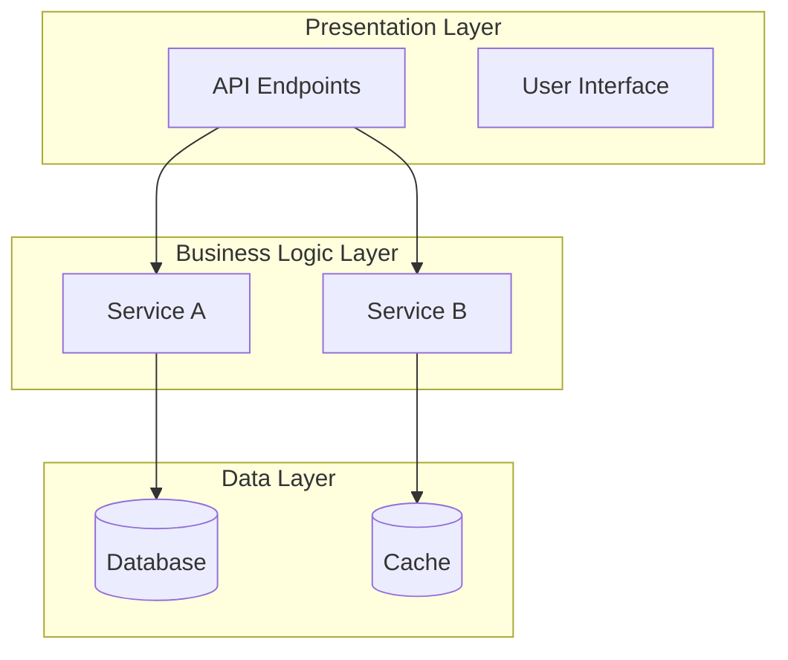
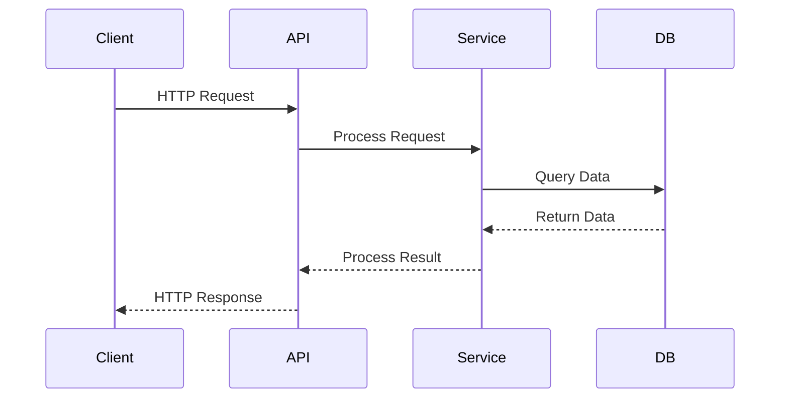

# Architecture Overview: [PROJECT_NAME]

> **Auto-generated by `.agent/workflows/discover-architecture.md`**
> **Generated:** [TIMESTAMP]

---

## Architecture Pattern

**Primary Pattern:** [Monolithic / Layered / Microservices / Event-Driven / Serverless / Hybrid]

**Justification:** [Why this pattern was chosen or evolved naturally]

---

## High-Level Architecture

*[Replace with actual architecture diagram]*

---

## Component Breakdown

### Layer 1: Presentation

**Purpose:** Handle incoming requests and present responses

| Component | Location | Responsibility |
|-----------|----------|----------------|
| [Component] | [Path] | [Description] |
| [Component] | [Path] | [Description] |

---

### Layer 2: Business Logic

**Purpose:** Core application logic and business rules

| Component | Location | Responsibility |
|-----------|----------|----------------|
| [Component] | [Path] | [Description] |
| [Component] | [Path] | [Description] |

---

### Layer 3: Data Access

**Purpose:** Data persistence and retrieval

| Component | Location | Responsibility |
|-----------|----------|----------------|
| [Component] | [Path] | [Description] |
| [Component] | [Description] |

---

## Data Flow

### Typical Request Flow

**Steps:**

1. [Step description]
2. [Step description]
3. [Step description]

---

## Integration Points

### External Dependencies

| Service | Type | Purpose | Authentication |
|---------|------|---------|----------------|
| [Service] | [Database/API/Queue] | [Purpose] | [Auth method] |
| [Service] | [Type] | [Purpose] | [Auth method] |

---

### Internal Communication

**Synchronous:**

- [Component A] → [Component B]: [Purpose]

**Asynchronous:**

- [Component A] → [Message Queue] → [Component B]: [Purpose]

---

## Design Patterns

### Identified Patterns

1. **[Pattern Name]** - [Where used]

- Purpose: [Why this pattern]
- Implementation: [How it's implemented]

1. **[Pattern Name]** - [Where used]

- Purpose: [Why]
- Implementation: [How]

---

## Technology Decisions

### Key Decisions

| Decision | Rationale | Trade-offs |
|----------|-----------|------------|
| [Tech choice] | [Why chosen] | [Pros/Cons] |
| [Tech choice] | [Why] | [Pros/Cons] |

---

## Scalability Considerations

### Current State

- **Vertical Scaling:** [Possible/Limited]
- **Horizontal Scaling:** [Possible/Limited]
- **Bottlenecks:** [Identified bottlenecks]

### Future Considerations

- [Scaling recommendation]
- [Scaling recommendation]

---

## Security Architecture

**Authentication:** [Method - JWT/OAuth/etc.]
**Authorization:** [RBAC/ABAC/etc.]
**Data Protection:** [Encryption at rest/transit]

---

## Deployment Architecture

**Environment:** [Development/Staging/Production]
**Deployment Model:** [Containerized/Serverless/VM-based]
**CI/CD:** [Pipeline description]

---

## Architectural Debt

### Identified Issues

1. **[Issue]**

- Impact: [High/Medium/Low]
- Recommendation: [How to address]
- Effort: [Estimated effort]

1. **[Issue]**

- Impact: [Level]
- Recommendation: [Fix]
- Effort: [Time]

---

## Architecture Decision Records (ADRs)

*If ADRs found in code/commits/docs:*

### ADR-001: [Decision Title]

- **Date:** [Date]
- **Status:** [Accepted/Deprecated/Superseded]
- **Context:** [Why decision needed]
- **Decision:** [What was decided]
- **Consequences:** [Impact]

---

## Next Steps

**Recommended Actions:**

1. [Action based on findings]
2. [Action]
3. [Action]

**Follow-up Workflows:**

- `/warn-tech-debt` - Identify refactoring opportunities
- `/brainstorm` - Plan architecture improvements
- `/document-api` - Document API layer in detail

---

## Metadata

**Generated By:** .agent/workflows/discover-architecture.md
**Template:** .agent/templates/discovered-architecture.md
**Analysis Date:** [TIMESTAMP]
**Components Analyzed:** [X components]
**Layers Identified:** [X layers]

---

*This is a living document. Re-run `/discover-architecture` after significant structural changes.*
