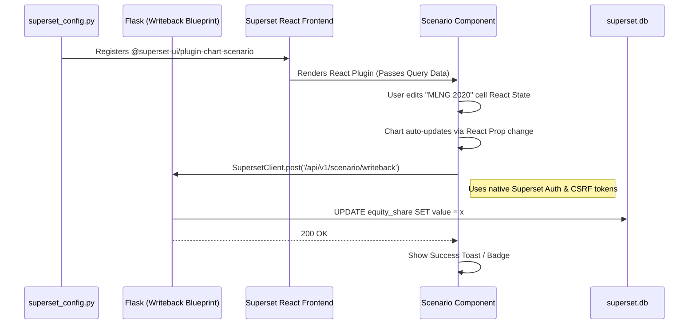

# Technical Specification: Native Scenario Plugin (React)

**Document Type:** Technical Specification  
**Status:** Approved for Implementation  
**Date:** 2026-03-09  
**Feature:** Scenario UI as a Native `@superset-ui` Visualization Plugin  
**Replaces:** Old standalone iframe approach.

## 1. Objective and Scope

The goal of this architectural spec is to port the interactive "Scenario Creation UI" (`docs/scenario-ui.html`) directly into Apache Superset as a **first-class custom chart plugin**.

This completely removes the need for iframe embedding, Guest Tokens, or standalone proxy servers.

1. **Native Integration:** The UI lives inside a Superset dashboard slice. Users authenticate natively via Superset login.
2. **Interactive Write-backs:** Users can edit grid cells directly within the dashboard. The plugin uses `SupersetClient` to POST updates to the Flask backend, benefiting from native CSRF and session management.

## 2. Architecture Diagram



## 3. Implementation Details (Dependency-Ordered)

### Step 1: Scaffold the Plugin

**Directory:** `superset-frontend/plugins/plugin-chart-scenario`
**Action:** Use Superset's native plugin generator to scaffold the boilerplate.

```bash
cd superset-frontend/packages/generator-superset
npm i -g yo
yo @superset-ui/superset
# Name: plugin-chart-scenario
```

### Step 2: Register the Plugin

**File:** `superset-frontend/src/visualizations/presets/MainPreset.js`
**Action:** Import and register `ScenarioChartPlugin` alongside the other native plugins so it appears in the Superset charting dropdown.

### Step 3: Implement the React Component (Frontend)

**File:** `plugin-chart-scenario/src/Scenario.tsx`
**Action:** Port the raw HTML/JS logic into a modern React functional component.

- **State Management:** Use `useState` to hold the grid arrays (`EXISTING_ROWS` and `GROWTH_ROWS`).
- **Ant Design:** Replace custom CSS tabs and form inputs with `@superset-ui/core` Ant Design components where applicable to ensure visual native consistency.
- **Chart:** Either use the existing generic `echarts` logic via Superset, or implement the `Chart.js` package internally within the plugin.
- **`onCellInput`:** Update the state, triggering an immediate re-render of the chart.

### Step 4: Hook the React Frontend to the API

**File:** `plugin-chart-scenario/src/Scenario.tsx`
**Action:** When a user commits a cell change (onBlur or onEnter):

```typescript
import { SupersetClient } from '@superset-ui/core';

SupersetClient.post({
  endpoint: '/api/v1/scenario/writeback',
  jsonPayload: { asset: 'MLNG', year: 2020, value: 90 }
}).then((response) => console.log('Saved!'));
```

### Step 5: Implement the Flask Write-back Endpoint (Backend)

**File:** `superset/views/scenario_writeback.py`
**Action:**

- The blueprint is already scaffolded from the previous session.
- Ensure it properly parses the JSON payload and returns the standard `200 OK` structure required by `SupersetClient`. (No CSRF exemptions needed anymore since we are native).

## 4. Verification Plan (Scaffold Gate)

1. **Build Gate:** `npm run build` in `superset-frontend` must pass without TypeScript errors.
2. **Registry Gate:** Log into Superset, click **Create Chart**, and verify "Scenario" appears in the visualization gallery.
3. **Data Gate:** Bind the chart to a dummy dataset, open the dashboard, and verify the custom UI renders perfectly.
4. **Transaction Gate:** Edit a cell on the dashboard and verify the Network Tab shows a successful `POST` request to `/api/v1/scenario/writeback` with the native Superset JSESSIONID and CSRF headers.
