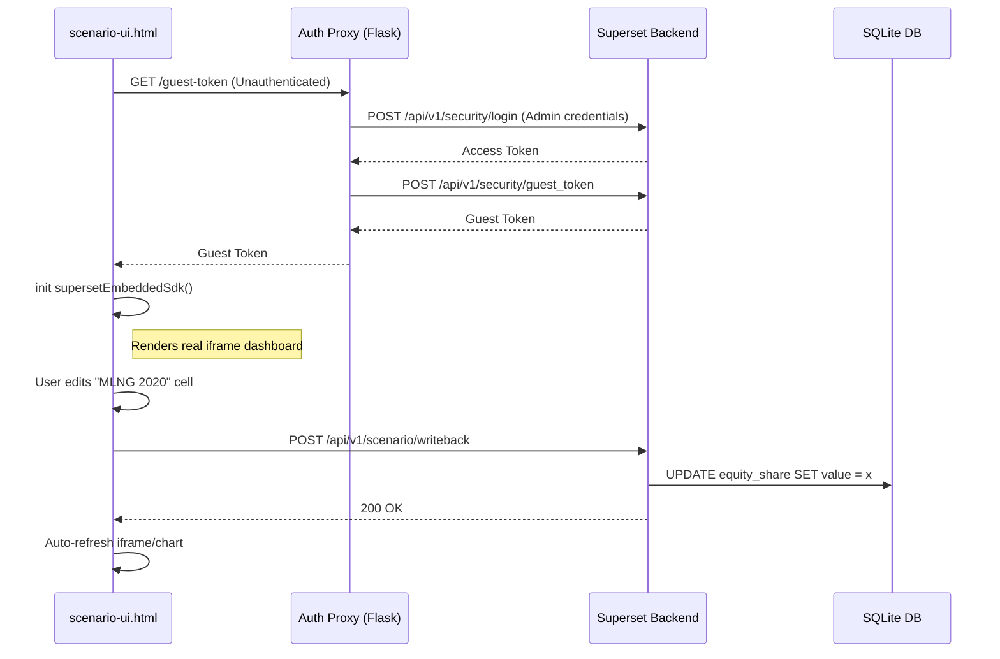

# Technical Specification: Scenario Integration MVP

**Document Type:** Technical Specification  
**Status:** Approved for Implementation  
**Date:** 2026-03-09  
**Feature:** Connect Standalone UI to Real Superset Backend + Enable Write-backs  

## 1. Objective and Scope

The goal of this architectural spec is to connect `docs/scenario-ui.html` (which currently renders fake JS data and a fake Chart.js graph) into a fully functional frontend that talks to a live Apache Superset instance.

This requires solving two main technical challenges:

1. **Secure Embedding:** Authenticating the HTML page to embed a real Superset dashboard without showing the Superset navbar (via `@superset-ui/embedded-sdk` and Guest Tokens).
2. **Interactive Write-backs:** Converting the HTML editable cells into real POST requests that modify a database, which in turn causes the embedded Superset chart to update.

## 2. Architecture Diagram



## 3. Data Models & Database Strategy

Since this is an MVP "Scenario" application built on top of Superset, the cleanest architectural path is to create a dedicated table in the Superset metadata database (SQLite `~/.superset/superset.db`) to store the scenario configurations.

**Table Definition:** `equity_share`

```sql
CREATE TABLE equity_share (
    id INTEGER PRIMARY KEY AUTOINCREMENT,
    scenario_type VARCHAR(50) NOT NULL, -- 'existing' or 'growth'
    business_unit VARCHAR(50) NOT NULL, -- 'LNGA', 'G&P', etc
    asset_name VARCHAR(100) NOT NULL,   -- 'MLNG', 'LNGC2', etc
    year INTEGER NOT NULL,              -- 2020 to 2030
    value FLOAT NOT NULL,               -- 0 to 100
    UNIQUE(scenario_type, asset_name, year)
);
```

*Note: Superset will connect to this SQLite database natively as a "Dataset" so charts can be built directly off this table.*

## 4. Implementation Details (Dependency-Ordered)

### Step 1: Initialize Database Schema

**File:** `scripts/init_scenario_db.py`
**Action:** Write a Python script that connects to `~/.superset/superset.db` and issues the `CREATE TABLE` and `INSERT` statements to seed the initial data (the 70s, 50s, and 100s previously hardcoded in the JS).

### Step 2: Write-back Blueprint (Backend)

**File:** `superset_config.py` & `superset/views/scenario_writeback.py`
**Action:**

- `superset_config.py` sets `WTF_CSRF_EXEMPT_LIST = ["superset.views.scenario_writeback.writeback"]` to allow external POST requests.
- `scenario_writeback.py` implements `POST /api/v1/scenario/writeback`. It connects securely to the SQLAlchemy metadata database and executes the `UPDATE` statement. Needs proper `logging`. Returns the updated row data.

### Step 3: Guest Token Auth Proxy (Backend)

**File:** `docs/proxy.py`
**Action:** Implement a minimal Flask service (port 3001) that holds the Superset "Admin" credentials.

- Exposes `GET /guest-token` to the frontend.
- Fetches a JWT access token via `/api/v1/security/login`.
- Fetches a CSRF token.
- Exchanges them for a Guest Token via `/api/v1/security/guest_token/` referencing the `EMBEDDED_UUID`.
- Returns the Guest Token to the frontend.

### Step 4: Frontend Embedded Integration (Frontend)

**File:** `docs/scenario-ui.html`
**Action:**

- Import `@superset-ui/embedded-sdk`.
- Remove the local `Chart.js` logic and `<canvas>` completely.
- Replace with `<div id="superset-embed-container" style="height: 400px;"></div>`.
- On page load, fetch the guest token from `http://localhost:3001/guest-token`.
- Mount the Superset iframe via `supersetEmbeddedSdk.embedDashboard(...)`.

### Step 5: Frontend Interactive Write-backs (Frontend)

**File:** `docs/scenario-ui.html`
**Action:**

- Update `onCellInput(input)` to fire an async `fetch()` `POST` to `http://localhost:8088/api/v1/scenario/writeback`.
- Pass the `{ table, asset, year, value }` payload.
- Upon 200 OK, trigger a refresh on the embedded dashboard (the SDK returns a dashboard object that can be used or the iframe can be forced to reload its charts).

## 5. Security & Constraints

1. **Standalone Config:** `superset_config.py` must have `GUEST_TOKEN_JWT_SECRET` explicitly set.
2. **CORS:** Ensure `ENABLE_CORS = True` in Superset config so the HTML file (running locally) can POST to the writeback API.
3. **Draft vs Live Data:** This specification modifies the "Live" MVP data immediately upon cell change. "Save Draft" or "Approval Workflow" logic (as seen in the UI) will just be UI mocks for this specific iteration until full RBAC is requested.

## 6. Verification Plan

1. **Unit Test:** Run `scripts/init_scenario_db.py` and verify `SELECT * FROM equity_share` works in SQLite.
2. **Integration Test:** Execute `curl -X POST http://localhost:8088/api/v1/scenario/writeback ...` and check DB update.
3. **End-to-End Test:** Open HTML file, edit cell `MLNG 2020` to `99`, verify the API response is 200, and ensure the embedded Superset iframe live-reloads showing `99`.
