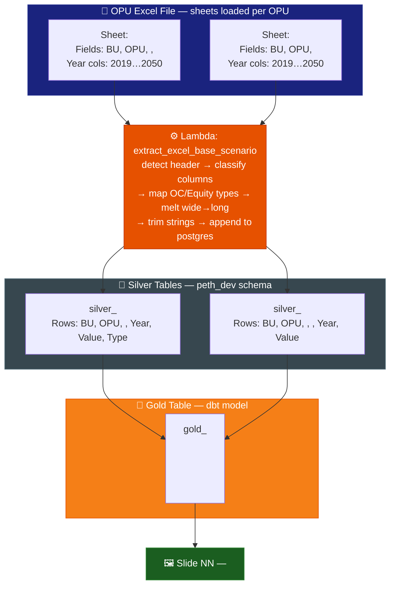

# Slide NN: [Title]

> **Gold table:** `gold_<table_name>` — or **NONE** (static template)
> **Source sheets:** `<SheetName1>`, `<SheetName2>`
> **dbt model:** `dbt_project/models/gold_table/gold_<table_name>.sql`

---

## Data Flow Diagram





> **Note — static/cover slide:** If this slide has no gold table, replace the `G1 --> SLIDE` arrow with:
>
> ```
> G1 -.->|"not used"| SLIDE["🖼️ ...
> Gold table: NONE
> ..."]
> ```

---

## Gold Table Used

`gold_<table_name>` — or **None** (static template, no query).

---

## Calculation Logic

| Step | Logic | Code Reference |
| --- | --- | --- |
| 1 | `<UNION / JOIN description>` | `gold_<model>.sql` L<N> |
| 2 | `<DEDUP ROW_NUMBER() OVER (PARTITION BY ...)>` | `gold_<model>.sql` L<N> |
| 3 | `<SUM(value) / 1,000,000>` | `gold_<model>.sql` L<N> |
| 4 | `<Filter: WHERE scenario_id = var('scenario_id')>` | `gold_<model>.sql` L<N> |

---

## Source Files

| File | Role |
| --- | --- |
| `functions/extract_excel_base_scenario/lambda_handler.py` | Parses Excel, writes silver tables |
| `dbt_project/models/gold_table/gold_<model>.sql` | Gold transform — calculation logic |
| `dbt_project/models/sources.yml` | Silver table registration |
| `functions/tableau_load/lambda_handler.py` | Pushes gold table to Tableau |

---

## Key Invariants

| # | Invariant | Code Reference |
| --- | --- | --- |
| 1 | `<e.g. Equity rows dropped — OC only>` | `lambda_handler.py` L<N> |
| 2 | `<e.g. Values scaled ÷ 1,000,000>` | `gold_<model>.sql` L<N> |
| 3 | `<e.g. Filtered by scenario_id + user_email>` | `gold_<model>.sql` L<N> |

---

## BRD Reference

- **BR-<N>**: <Business rule description>
- **BR-<N>**: <Business rule description>

---

<!--
CHECKLIST — delete before publishing:
[ ] Every table name verified against sources.yml or dbt_project/models/gold_table/
[ ] Every sheet name verified against lambda_handler.py sheet handling logic
[ ] No \n escape sequences in the Mermaid block (real newlines only)
[ ] Gold table is NONE for static/template slides — dashed arrow used
[ ] BRD references checked against docs/features/brd.md
[ ] All code references cite exact line numbers
-->
