# DB Schema: PETH ESG Dashboard

> **Schema:** `peth_prod` | **Engine:** PostgreSQL (AWS RDS)
> **Source of truth:** `docs/database/database.dbml`
> **DDL reference:** `init_db_script/create_table.sql`
> **dbt models:** `dbt_project/models/models.yml`, `dbt_project/models/gold_table/`

---

## Architecture Overview

The database is organised into two layers:

| Layer | Prefix | Role | Written by |
| --- | --- | --- | --- |
| **Silver** | `silver_*` | Raw, long-format rows extracted from OPU Excel uploads | Lambda `extract_excel_base_scenario` |
| **Gold** | `gold_*` | Aggregated, presentation-aligned analytics models | dbt incremental models |

Every table shares a **composite key** of `(scenario_id, user_email)` to isolate each user's planning scenario. The gold models use `ROW_NUMBER() OVER (ORDER BY updated_at DESC)` to deduplicate append-only silver writes before aggregating.

---

## Data Flow Diagram

```mermaid
flowchart TD

    subgraph EXCEL["OPU Excel File — one file per OPU uploaded via PETH web app"]
        SH["Wide-format sheets\nYear columns: 2019 to 2050\nRows: BU, OPU, parameter dimensions"]
    end

    subgraph LAMBDA["Lambda: extract_excel_base_scenario\nDetect header row\nClassify OC vs Equity Share rows\nMelt wide to long format\nAppend to silver tables"]
    end

    subgraph SILVER["Silver Layer — peth_prod"]
        S1["silver_emission\nTotal GHG by scope + location"]
        S2["silver_emission_by_gases\nGHG disaggregated by gas species"]
        S3["silver_emission_by_sources\nGHG by emission source"]
        S4["silver_energy_consumption\nEnergy by category (GJ, LHV)"]
        S5["silver_energy_saved\nEnergy efficiency savings"]
        S6["silver_production\nBAU production volumes"]
        S7["silver_decarb\nReduction project quantities"]
        S8["silver_capex_opex\nGreen CAPEX and OPEX spend"]
        S9["silver_growth_projects_emission\nGrowth project GHG forecast"]
        S10["silver_growth_projects_production\nGrowth project production forecast"]
        S11["silver_proposed_growth_projects_reduction\nGrowth project reduction credits"]
        S12["silver_petronas_effective_equity\nBAU PEE percentages"]
        S13["silver_growth_petronas_effective_equity\nGrowth project PEE"]
        S14["hierarchy / branch / custom_hierarchy\nOrganizational structure tables"]
    end

    subgraph GOLD["Gold Layer — peth_prod (dbt incremental)"]
        G1["gold_ghg_emission\ngold_ghg_emission_upon_reduction\ngold_ghg_reduction\ngold_ghg_intensity\ngold_ghg_intensity_rollup"]
        G2["gold_slide8_emission\ngold_slide8_intensity\ngold_methane_intensity"]
        G3["gold_energy_intensity\ngold_slide9_consumption\ngold_slide9_intensity"]
        G4["gold_summary_growth\ngold_slide4\ngold_decarb_capex\ngold_slide5\ngold_slide2_slide3\ngold_summary_sheet"]
        G5["gold_slide12\ngold_slide13\ngold_slide14\n(Production Profile models)"]
    end

    EXCEL --> LAMBDA
    LAMBDA --> SILVER
    S3 & S14 --> G1
    S2 & S6 & S14 --> G2
    S4 & S5 & S6 & S14 --> G3
    S7 & S8 & S9 & S10 & S11 & S12 & S13 & S14 --> G4
    S6 & S14 --> G5

    GOLD --> TABLEAU["Tableau Dashboard\nSlides 2–14"]


    style EXCEL fill:#1A237E,color:#fff,stroke:#283593
    style LAMBDA fill:#E65100,color:#fff,stroke:#BF360C
    style SILVER fill:#37474F,color:#fff,stroke:#546E7A
    style GOLD fill:#F57F17,color:#fff,stroke:#E65100
    style TABLEAU fill:#1B5E20,color:#fff,stroke:#388E3C
```

---

## Silver Tables

Silver tables are append-only. Lambda writes a new row on every upload. dbt deduplicates using `ROW_NUMBER() OVER (PARTITION BY <natural_key> ORDER BY updated_at DESC)`.

---

### `silver_capex_opex`

**Purpose:** Green CAPEX and OPEX per decarbonisation project per year.
**Source sheet:** `CAPEX/OPEX`

| Column | Type | Meaning |
| --- | --- | --- |
| `id` | uuid | Surrogate primary key — `gen_random_uuid()` on insert |
| `bu` | text | Business Unit — e.g. GAS, D&C |
| `opu` | text | Operating Unit — e.g. MLNG, GPK, GTR |
| `levers` | text | Decarbonisation lever category — e.g. Carbon Capture, Flaring Reduction, Fuel Switch |
| `targeted_source` | text | Emission source targeted — e.g. Flaring, Venting, Combustion |
| `scope` | text | GHG Scope — Scope 1, Scope 2, or Scope 3 |
| `methane_project_yes_no` | text | Yes/No flag: does this project specifically target methane reduction? |
| `project_name` | text | Short display name for the decarbonisation project |
| `project_description` | text | Full narrative description of the project objective and approach |
| `commercial_operation_date` | timestamp | Target COD — when the project achieves commercial operation |
| `project_status` | text | Lifecycle stage — Identified, Feasibility, Approved, In Progress, Completed |
| `internal_manpower_rm_year` | numeric | Estimated internal manpower cost in RM per year |
| `value_creation_rm_year` | numeric | Expected value creation benefit in RM per year |
| `year` | text | Calendar year the CAPEX/OPEX spend applies to |
| `green_capex_rm` | numeric | Green capital expenditure in RM for this project-year |
| `green_opex_rm` | numeric | Green operating expenditure in RM for this project-year |
| `sheet` | text | Source Excel sheet name — ingestion audit trail |
| `scenario_id` | text | Planning scenario identifier |
| `user_email` | text | Email of the PETH user who uploaded the file |
| `updated_at` | timestamp | Record last-write timestamp — used by dbt dedup |

---

### `silver_decarb`

**Purpose:** Emission reduction quantities (tCO2e) per decarbonisation project per year.
**Source sheet:** `Decarbonisation`

| Column | Type | Meaning |
| --- | --- | --- |
| `id` | uuid | Surrogate primary key |
| `bu` | text | Business Unit |
| `opu` | text | Operating Unit owning the reduction project |
| `levers` | text | Reduction lever category — e.g. Carbon Capture, Flaring Reduction, Fuel Switch |
| `targeted_source` | text | Emission source addressed by the project |
| `scope` | text | GHG Scope (Scope 1 / 2 / 3) |
| `methane_project_yes_no` | text | Yes/No flag: is this a methane-specific reduction project? |
| `project_name` | text | Project short name |
| `project_description` | text | Project narrative description |
| `commercial_operation_date` | timestamp | Planned COD for the reduction project |
| `project_status` | text | Project lifecycle status |
| `year` | text | Year the reduction quantity applies |
| `value` | numeric | Emission reduction volume in tCO2e for this project-year |
| `type` | text | Accounting boundary — Operational Control or Equity Share |
| `sheet` | text | Source Excel sheet name |
| `scenario_id` | text | Planning scenario identifier |
| `user_email` | text | Uploading user email |
| `updated_at` | timestamp | Record last-write timestamp — used for deduplication |
| `file_path` | text | S3 key of the source Excel file |

---

### `silver_emission`

**Purpose:** Total GHG emissions by scope and geographic location.
**Source sheet:** `GHG Emission`

| Column | Type | Meaning |
| --- | --- | --- |
| `id` | uuid | Surrogate primary key |
| `bu` | text | Business Unit |
| `opu` | text | Operating Unit — facility or asset name |
| `location` | text | Geographic location — e.g. Sarawak, Sabah, Australia, Egypt |
| `scope` | text | GHG scope — Scope 1 (direct), Scope 2 (indirect energy), Scope 3 (value chain) |
| `uom` | text | Unit of measure — tCO2e |
| `year` | text | Reporting year |
| `value` | numeric | Raw emission volume in tCO2e for this OPU-scope-year |
| `type` | text | Accounting boundary — Operational Control (OC) or Equity Share (ES) |
| `sheet` | text | Source Excel sheet name |
| `scenario_id` | text | Planning scenario identifier |
| `user_email` | text | Uploading user email |
| `updated_at` | timestamp | Record last-write timestamp |
| `file_path` | text | S3 key of the source Excel file |

---

### `silver_emission_by_gases`

**Purpose:** GHG emissions disaggregated by individual gas species.
**Source sheet:** `GHG Emission by Gases`
**Key consumer:** `gold_slide8_emission` and `gold_slide8_intensity` filter `gases = 'CH4'`.

| Column | Type | Meaning |
| --- | --- | --- |
| `id` | uuid | Surrogate primary key |
| `bu` | text | Business Unit |
| `opu` | text | Operating Unit — raw facility code (e.g. GPK, GPS, TSET) |
| `gases` | text | Gas species — CH4, CO2, N2O, HFCs, PFCs, SF6, NF3 |
| `source` | text | Emission source within the facility — Flaring, Venting, Combustion |
| `uom` | text | Unit of measure — tonne (raw gas mass, not CO2e) |
| `year` | text | Reporting year |
| `value` | numeric | Gas emission mass in tonnes for this OPU-gas-source-year |
| `type` | text | Accounting boundary — Operational Control or Equity Share |
| `sheet` | text | Source Excel sheet name |
| `scenario_id` | text | Planning scenario identifier |
| `user_email` | text | Uploading user email |
| `updated_at` | timestamp | Record last-write timestamp |
| `file_path` | text | S3 key of the source Excel file |

---

### `silver_emission_by_sources`

**Purpose:** GHG emissions by emission source category within each scope.
**Source sheet:** `GHG Emission by Sources`
**Key consumer:** `gold_ghg_emission` aggregates this table.

| Column | Type | Meaning |
| --- | --- | --- |
| `id` | uuid | Surrogate primary key |
| `bu` | text | Business Unit |
| `opu` | text | Operating Unit |
| `scope` | text | GHG Scope (Scope 1 / 2 / 3) |
| `source` | text | Emission source within the scope — Flaring, Venting, Stationary Combustion, Electricity Import |
| `uom` | text | Unit of measure — tCO2e |
| `year` | text | Reporting year |
| `value` | numeric | Emission volume in tCO2e for this source-year |
| `type` | text | Accounting boundary — Operational Control or Equity Share |
| `sheet` | text | Source Excel sheet name |
| `scenario_id` | text | Planning scenario identifier |
| `user_email` | text | Uploading user email |
| `updated_at` | timestamp | Record last-write timestamp |
| `file_path` | text | S3 key of the source Excel file |

---

### `silver_energy_consumption`

**Purpose:** Energy consumed per OPU broken down by energy category.
**Source sheet:** `Energy Consumption`
**Note:** No `type` column — energy is not split OC/ES at source. The OC/ES split is inherited from the JOIN with `silver_production` in the gold model.

| Column | Type | Meaning |
| --- | --- | --- |
| `id` | uuid | Surrogate primary key |
| `bu` | text | Business Unit |
| `opu` | text | Operating Unit — raw facility code |
| `scope` | text | Energy scope grouping — typically Scope 1 or Scope 2 |
| `source` | text | Energy category — Stationary Combustion, Electricity Import, Internal Energy Recovery, Renewable Energy |
| `uom` | text | Unit of measure — GJ (gigajoules, Lower Heating Value basis) |
| `year` | text | Reporting year |
| `value` | numeric | Energy consumed in GJ for this OPU-category-year |
| `sheet` | text | Source Excel sheet name |
| `scenario_id` | text | Planning scenario identifier |
| `user_email` | text | Uploading user email |
| `updated_at` | timestamp | Record last-write timestamp |
| `file_path` | text | S3 key of the source Excel file |

---

### `silver_energy_saved`

**Purpose:** Energy efficiency savings to be deducted from gross consumption.
**Source sheet:** `Energy Saved`
**Key consumer:** `silver_energy_consumption_upon_reduction` subtracts this from `silver_energy_consumption`.

| Column | Type | Meaning |
| --- | --- | --- |
| `id` | uuid | Surrogate primary key |
| `bu` | text | Business Unit |
| `opu` | text | Operating Unit |
| `scope` | text | Energy scope grouping |
| `source` | text | Source of the saving — e.g. Operational Efficiency, Heat Recovery, Renewable Energy |
| `uom` | text | Unit of measure — GJ (gigajoules) |
| `year` | text | Year the saving is realised |
| `value` | numeric | Energy saved in GJ — subtracted in the upon-reduction silver model |
| `sheet` | text | Source Excel sheet name |
| `scenario_id` | text | Planning scenario identifier |
| `user_email` | text | Uploading user email |
| `updated_at` | timestamp | Record last-write timestamp |
| `file_path` | text | S3 key of the source Excel file |

---

### `silver_production`

**Purpose:** BAU production volumes per OPU and production parameter.
**Source sheet:** `Production`
**Key consumer:** Intensity gold models use this as the denominator. MTPA values are scaled × 1,000,000 to convert to tonnes.

| Column | Type | Meaning |
| --- | --- | --- |
| `id` | uuid | Surrogate primary key |
| `bu` | text | Business Unit |
| `opu` | text | Operating Unit — raw facility code (e.g. GPK, UK, GT) |
| `parameters` | text | Production parameter name — e.g. LNG Production, Electricity Generation, Gas Production |
| `uom` | text | Unit of measure — MTPA (million tonnes/year), MWh/yr, (t-nm), Thousand manhours |
| `profile` | text | Production profile type — e.g. Plateau, Decline; used for scenario shaping |
| `year` | text | Reporting or forecast year |
| `value` | numeric | Production volume in the stated UOM for this OPU-parameter-year |
| `sheet` | text | Source Excel sheet name |
| `scenario_id` | text | Planning scenario identifier |
| `user_email` | text | Uploading user email |
| `updated_at` | timestamp | Record last-write timestamp |
| `file_path` | text | S3 key of the source Excel file |

---

### `silver_growth_projects_emission`

**Purpose:** Forecast GHG emissions from new growth projects (not yet in BAU portfolio).
**Source sheet:** `Growth Projects Emission`

| Column | Type | Meaning |
| --- | --- | --- |
| `id` | uuid | Surrogate primary key |
| `bu` | text | Business Unit sponsoring the growth project |
| `growth_project` | text | Growth project name — identifies new assets not yet in BAU |
| `project_description` | text | Narrative description of the growth project |
| `business_model` | text | Commercial model — e.g. LNG, Gas Processing, Petrochemicals, Renewables |
| `location` | text | Geographic location of the growth project |
| `fid_status_yes_no` | text | FID status — Yes (approved) or No (not yet approved) |
| `cod` | text | Commercial Operation Date — year the asset starts operating |
| `uom` | text | Unit of measure — tCO2e |
| `year` | text | Year the forecast emission applies |
| `value` | numeric | Forecast emission volume (tCO2e) for this project-year |
| `type` | text | Accounting boundary — Operational Control or Equity Share |
| `sheet` | text | Source Excel sheet name |
| `scenario_id` | text | Planning scenario identifier |
| `user_email` | text | Uploading user email |
| `updated_at` | timestamp | Record last-write timestamp |
| `file_path` | text | S3 key of the source Excel file |

---

### `silver_growth_projects_production`

**Purpose:** Forecast production volumes from growth projects.
**Source sheet:** `Growth Projects Production`

| Column | Type | Meaning |
| --- | --- | --- |
| `id` | uuid | Surrogate primary key |
| `bu` | text | Business Unit |
| `growth_project` | text | Growth project name |
| `project_description` | text | Project description |
| `business_model` | text | Commercial model |
| `location` | text | Geographic location |
| `fid_status_yes_no` | text | FID status (Yes/No) |
| `cod` | text | Commercial Operation Date |
| `uom` | text | Unit of measure — MTPA for LNG, MWh/yr for utilities, (t-nm) for shipping, etc. |
| `year` | text | Forecast year |
| `value` | numeric | Forecast production volume for this project-year in the stated UOM |
| `type` | text | Accounting boundary — Operational Control or Equity Share |
| `sheet` | text | Source Excel sheet name |
| `scenario_id` | text | Planning scenario identifier |
| `user_email` | text | Uploading user email |
| `updated_at` | timestamp | Record last-write timestamp |
| `file_path` | text | S3 key of the source Excel file |

---

### `silver_proposed_growth_projects_reduction`

**Purpose:** Emission reductions credited to growth project engineering designs.
**Source sheet:** `Growth Projects Reduction`
**Key consumer:** Slide 4 waterfall — shows how growth project design choices reduce net GHG.

| Column | Type | Meaning |
| --- | --- | --- |
| `id` | uuid | Surrogate primary key |
| `bu` | text | Business Unit |
| `growth_project` | text | Growth project name |
| `project_description` | text | Project description |
| `business_model` | text | Commercial model |
| `location` | text | Geographic location |
| `fid_status_yes_no` | text | FID status (Yes/No) |
| `cod` | text | Commercial Operation Date |
| `uom` | text | Unit of measure — tCO2e |
| `year` | text | Year the reduction applies |
| `value` | numeric | Emission reduction (tCO2e) credited to this growth project design |
| `type` | text | Accounting boundary — Operational Control or Equity Share |
| `sheet` | text | Source Excel sheet name |
| `scenario_id` | text | Planning scenario identifier |
| `user_email` | text | Uploading user email |
| `updated_at` | timestamp | Record last-write timestamp |
| `file_path` | text | S3 key of the source Excel file |

---

### `silver_petronas_effective_equity`

**Purpose:** PETRONAS effective equity (PEE %) in existing BAU operating assets.

| Column | Type | Meaning |
| --- | --- | --- |
| `id` | uuid | Surrogate primary key |
| `bu` | text | Business Unit |
| `opu` | text | Operating Unit (existing BAU asset) |
| `profile` | text | Equity profile type — e.g. Petronas Effective Equity (PEE) |
| `year` | text | Year the equity figure applies |
| `value` | numeric | PETRONAS effective equity percentage (%) for this OPU-year |
| `sheet` | text | Source Excel sheet name |
| `scenario_id` | text | Planning scenario identifier |
| `user_email` | text | Uploading user email |
| `updated_at` | timestamp | Record last-write timestamp |
| `file_path` | text | S3 key of the source Excel file |

---

### `silver_growth_petronas_effective_equity`

**Purpose:** PETRONAS equity share in growth (new) projects.

| Column | Type | Meaning |
| --- | --- | --- |
| `id` | uuid | Surrogate primary key |
| `bu` | text | Business Unit owning the growth project |
| `opu` | text | Operating Unit linked to the growth project |
| `projects` | text | Growth project name or identifier |
| `year` | text | Year the equity figure applies |
| `value` | numeric | PETRONAS effective equity percentage (%) in this growth project-year |
| `sheet` | text | Source Excel sheet name |
| `scenario_id` | text | Planning scenario identifier |
| `user_email` | text | Uploading user email |
| `updated_at` | timestamptz | Record last-write timestamp (timezone-aware) |
| `file_path` | text | S3 key of the source Excel file |

---

### `hierarchy` / `branch` / `custom_hierarchy`

**Purpose:** Master data for organizational rollup and OPU mapping.
**Source:** Fixed reference tables (not uploaded via Lambda).

| Table | Meaning |
| --- | --- |
| `hierarchy` | Full sector-to-OPU mapping tree. |
| `branch` | Regional or functional groupings. |
| `custom_hierarchy` | Manual overrides for Tableau presentation aliases. |

---

## Gold Tables

Gold tables are dbt incremental models, keyed on `(scenario_id, user_email)`. They contain deduplicated, aggregated, presentation-ready data consumed by Tableau.

### Gold Table → Slide Mapping

| Gold Table | Slide(s) | Metric |
| --- | --- | --- |
| `gold_ghg_emission` | 2, 3, 6 | Total GHG emissions by OPU (tCO2e) |
| `gold_ghg_emission_upon_reduction` | 2, 3 | Net GHG after decarbonisation reductions (tCO2e) |
| `gold_ghg_reduction` | 2, 3, 5 | Reduction project quantities (tCO2e) |
| `gold_ghg_intensity` | Legacy intensity | GHG intensity (tCO2e/tonne) — raw OPU level |
| `gold_ghg_intensity_rollup` | 7 | GHG intensity rolled up to group level |
| `gold_slide2_slide3` | 2, 3 | DA long format: GHG Emission + GHG Intensity dual panel |
| `gold_slide4` | 4 | Growth project pipeline: emission, reduction, equity, COD |
| `gold_slide5` | 5 | CAPEX / OPEX investment totals |
| `gold_slide8_emission` | 8 | Methane emission forecast (ktCH4) — OPU bars + Total L3 line |
| `gold_slide8_intensity` | 8 | Methane intensity forecast (tCH4/tonne or tCH4/MWh) — per rollup |
| `gold_methane_intensity` | Legacy | Legacy methane intensity — raw OPU, hardcoded UOM |
| `gold_energy_intensity` | 9 (legacy) | Energy intensity (GJ/tonne) — hardcoded UOM |
| `gold_slide9_consumption` | 9 | Energy consumption forecast (Mil GJ) + category breakdown |
| `gold_slide9_intensity` | 9 | Energy intensity with dynamic UOM per group |
| `gold_summary_growth` | Growth slides | Growth project emission + reduction combined |
| `gold_decarb_capex` | 5 | Decarbonisation + CAPEX/OPEX combined |
| `gold_summary_sheet` | Summary | Executive KPI rollup |
| `gold_slide12` | 12 | LNGA Upstream Feedgas & LNG Production Profile |
| `gold_slide13` | 13 | Kerteh Feedgas & Salesgas Production Profile (PGB) |
| `gold_slide14` | 14 | NOJV Production Profile (TTM + KPSB/PGSSB) |

---

### `gold_ghg_emission`

**Source:** `silver_emission_by_sources`

| Column | Type | Meaning |
| --- | --- | --- |
| `id` | text | Comma-separated source row IDs from silver — audit trail |
| `bu` | text | Business Unit |
| `opu` | text | Display-ready OPU name (e.g. MLNG, PFLNG 1, Total BAU) |
| `location` | text | Geographic region |
| `uom` | text | Always tCO2e at gold layer |
| `value` | numeric | Total aggregated GHG emission (tCO2e) for this OPU-year |
| `year` | text | Calendar year |
| `type` | text | Operational Control or Equity Share |
| `scenario_id` | text | Planning scenario identifier |
| `user_email` | text | Uploading user — composite unique key with scenario_id |
| `updated_at` | timestamp | Record last-write timestamp |
| `file_path` | text | S3 path(s) to source file(s) — comma-separated across OPUs |

---

### `gold_ghg_emission_upon_reduction`

**Source:** `gold_ghg_emission` + `silver_decarb`

| Column | Type | Meaning |
| --- | --- | --- |
| `id` | text | Pipe-separated row IDs — emission side\|decarb side |
| `bu` | text | Business Unit |
| `opu` | text | Operating Unit — e.g. GPU, GTR, Total BAU |
| `location` | text | Geographic region |
| `uom` | text | tCO2e |
| `value` | numeric | Net GHG = gross emission minus decarbonisation reductions (tCO2e) |
| `year` | text | Calendar year |
| `type` | text | Operational Control or Equity Share |
| `scenario_id` | text | Planning scenario identifier |
| `user_email` | text | Uploading user email |
| `updated_at` | timestamp | Record last-write timestamp |
| `file_path` | text | S3 path(s) to source file(s) |

---

### `gold_ghg_reduction`

**Source:** `silver_decarb`

| Column | Type | Meaning |
| --- | --- | --- |
| `id` | text | Comma-separated source row IDs from silver_decarb |
| `bu` | text | Business Unit — GAS |
| `opu` | text | BAU (in-operation projects) or W/O BAU (non-BAU projects) |
| `uom` | text | tCO2e |
| `value` | numeric | Emission reduction volume (tCO2e) credited to this project-year |
| `year` | text | Calendar year |
| `type` | text | Operational Control or Equity Share |
| `scenario_id` | text | Planning scenario identifier |
| `user_email` | text | Uploading user email |
| `updated_at` | timestamp | Record last-write timestamp |

---

### `gold_ghg_intensity`

**Source:** `gold_ghg_emission` + `silver_production`

| Column | Type | Meaning |
| --- | --- | --- |
| `id` | text | Source row IDs — pipe-separated (emission\|production) |
| `bu` | text | Business Unit |
| `opu` | text | Operating Unit |
| `uom` | text | tCO2e/tonne |
| `total_emission` | numeric | Total GHG (tCO2e) — numerator |
| `total_production` | numeric | Production (tonnes, MTPA × 1M) — denominator |
| `production_intensity` | numeric | = total_emission / total_production (tCO2e/tonne) |
| `type` | text | Operational Control or Equity Share |
| `year` | text | Calendar year |
| `scenario_id` | text | Planning scenario identifier |
| `user_email` | text | Uploading user email |
| `updated_at` | timestamp | Record last-write timestamp |

---

### `gold_slide8_emission`

**Source:** `silver_emission_by_gases` (filter: `gases = 'CH4'`)

| Column | Type | Meaning |
| --- | --- | --- |
| `id` | text | Source row IDs from silver_emission_by_gases |
| `category` | text | Always "Methane Emission Forecast" |
| `metric` | text | OPU alias in DA format — GPU (= GPK+GPS+TSET), GTR, MLNG, PLC, Total L3 CH4 |
| `type` | text | Always Operational Control |
| `uom` | text | ktCH4 — raw silver tonnes ÷ 1000 |
| `value` | numeric | Methane emission in ktCH4 for this OPU alias-year |
| `year` | text | Calendar year (2025–2030+) |
| `scenario_id` | text | Planning scenario identifier |
| `user_email` | text | Uploading user email |
| `updated_at` | timestamp | Record last-write timestamp |

---

### `gold_slide8_intensity`

**Source:** `silver_emission_by_gases` (CH4) + `silver_production`

| Column | Type | Meaning |
| --- | --- | --- |
| `id` | text | UUID surrogate — fully pre-aggregated UNION ALL output |
| `intensity_group` | text | Display group — Gas Processing, LNG Processing, Utilities, Gas Business |
| `metric` | text | Rollup entity — Gas Business, LNGA, PLC, PFLNG 1, PFLNG 2, GPP, GTR, Utilities |
| `type` | text | Operational Control |
| `uom` | text | Dynamic — tCH4/tonne for gas/LNG; tCH4/MWh for Utilities (UK+UG) |
| `total_methane_emission` | numeric | Sum of CH4 mass (tonnes) — numerator before ktCH4 conversion |
| `total_production` | numeric | Denominator: tonnes (gas/LNG) or MWh (Utilities) |
| `methane_intensity` | numeric | = total_methane_emission / total_production |
| `year` | text | Calendar year |
| `scenario_id` | text | Planning scenario identifier |
| `user_email` | text | Uploading user email |
| `updated_at` | timestamp | Record last-write timestamp |

**Rollup definitions (per FRS S-07-08):**

| Rollup | Component OPUs |
| --- | --- |
| PLC | MLNG + MLNG DUA + MLNG TIGA + TRAIN 9 |
| LNGA | PLC + PFLNG 1 + PFLNG 2 + PFLNG 3 + ZLNG |
| Gas Business | GPP + GTR |
| Gas Processing | LNGA + Gas Business |
| Utilities | UK + UG |

---

### `gold_methane_intensity` (Legacy)

**Source:** `silver_emission_by_gases` + `silver_production`

> **Known bug:** `uom` hardcoded to `'tonne CH4/tonne'` for all rows including Utilities. Superseded by `gold_slide8_intensity` for Slide 8. Do not use for new Tableau charts.

| Column | Type | Meaning |
| --- | --- | --- |
| `id` | text | Source row IDs — pipe-separated |
| `bu` | text | Business Unit |
| `opu` | text | Raw facility code — not yet remapped to DA aliases |
| `uom` | text | HARDCODED to "tonne CH4/tonne" for all rows including Utilities |
| `total_methane_emission` | numeric | CH4 mass (tCH4) — numerator |
| `total_production` | numeric | Production (tonnes) — denominator; MTPA × 1M scaling applied |
| `methane_intensity` | numeric | = total_methane_emission / total_production |
| `type` | text | Operational Control or Equity Share |
| `year` | text | Calendar year |
| `scenario_id` | text | Planning scenario identifier |
| `user_email` | text | Uploading user email |
| `updated_at` | timestamp | Record last-write timestamp |

---

### `gold_energy_intensity` (Legacy)

**Source:** `silver_energy_consumption` + `silver_production`

> **Known bug:** `uom` hardcoded to `'GJ/tonne'` regardless of actual denominator. Utilities use MWh, Shipping uses Mil t-nm, MMHE uses thousand manhours — all three are labelled incorrectly. Superseded by `gold_slide9_intensity` for Slide 9 right panel.

| Column | Type | Meaning |
| --- | --- | --- |
| `id` | text | Source row IDs — pipe-separated |
| `opu` | text | Remapped OPU aliases (GPK/GPS/TSET→GPP, UK/UG→UT, GT/RGTP/RGTSU→GTR) |
| `uom` | text | HARDCODED to "GJ/tonne" regardless of actual denominator |
| `total_energy_consumption` | numeric | Energy (GJ, LHV basis) — numerator |
| `total_production` | numeric | Production in denominator unit (tonnes/MWh/etc.) |
| `energy_intensity` | numeric | = total_energy_consumption / total_production |
| `year` | text | Calendar year |
| `scenario_id` | text | Planning scenario identifier |
| `user_email` | text | Uploading user email |
| `updated_at` | timestamp | Record last-write timestamp |

---

### `gold_slide9_consumption`

**Source:** `silver_energy_consumption` + `silver_production`

| Column | Type | Meaning |
| --- | --- | --- |
| `id` | text | Comma-separated source row IDs |
| `category` | text | "Energy Consumption Forecast" (bars), "Production Reference" (lines), or "Energy Category Breakdown" (%) |
| `metric` | text | OPU name, production type, or energy category — e.g. PLC, LNG Production, Stationary Combustion |
| `type` | text | Always "OPERATIONAL CONTROL" |
| `uom` | text | "Mil GJ per year" for bars/lines; "%" for category breakdown |
| `year` | text | Calendar year (2025–2030) |
| `value` | numeric | Energy (Mil GJ) or category share (%) |
| `scenario_id` | text | Planning scenario identifier |
| `user_email` | text | Uploading user email |
| `updated_at` | timestamp | Record last-write timestamp |

---

### `gold_slide9_intensity`

**Source:** `silver_energy_consumption` + `silver_production`
**Fixes:** Hardcoded UOM bug in `gold_energy_intensity` — assigns dynamic UOM per `intensity_group`.

| Column | Type | Meaning |
| --- | --- | --- |
| `id` | text | Source row IDs |
| `intensity_group` | text | Gas Processing, Utilities, Shipping, or MMHE |
| `metric` | text | OPU or rollup entity — Gas Business, PLC, PFLNG1, PFLNG2, ZLNG, GPP, GTR, Utilities, Shipping, MMHE |
| `type` | text | "OPERATIONAL CONTROL" |
| `uom` | text | Dynamic: GJ/tonne (Gas Processing), GJ/MWh (Utilities), GJ/Mil t-nm (Shipping), GJ/thousands manhours (MMHE) |
| `year` | text | Calendar year (2025–2030) |
| `total_energy_consumption` | numeric | Energy numerator (GJ) |
| `total_production` | numeric | Production denominator in group-appropriate unit |
| `energy_intensity` | numeric | = total_energy_consumption / total_production |
| `scenario_id` | text | Planning scenario identifier |
| `user_email` | text | Uploading user email |
| `updated_at` | timestamp | Record last-write timestamp |

---

### `gold_slide4`

**Source:** `silver_growth_projects_emission` + `silver_growth_projects_production` + `silver_growth_petronas_effective_equity`

| Column | Type | Meaning |
| --- | --- | --- |
| `cod` | text | Commercial Operation Date — x-axis placement in bubble chart |
| `petronas_effective_equity` | numeric | PETRONAS equity % in the project |
| `project_description` | text | Full narrative description |
| `project_name` | text | Bubble label |
| `project_sanction` | text | Sanction status — colours the bubble (e.g. Sanctioned, Pre-FID, Concept) |
| `sector` | text | Business sector — bubble grouping (e.g. LNG, Gas Processing, Power) |
| `year` | text | Forecast year |
| `type` | text | Operational Control or Equity Share |
| `annual_ghg_emission` | numeric | Annual GHG (tCO2e) — bubble size or y-axis |
| `annual_ghg_reduction` | numeric | Annual reduction credit (tCO2e) from design choices |
| `scenario_id` | text | Planning scenario identifier |
| `user_email` | text | Uploading user email |
| `updated_at` | timestamp | Record last-write timestamp |

---

### `gold_summary_growth`

**Source:** `silver_growth_projects_emission` + `silver_proposed_growth_projects_reduction`

| Column | Type | Meaning |
| --- | --- | --- |
| `id` | text | Comma-separated source row IDs |
| `bu` | text | "GROWTH" for project rows, null for Total BAU aggregation |
| `opu` | text | Growth project name or "Total BAU" — x-axis label in growth waterfall |
| `fid_status` | text | FID Yes/No — only FID=Yes rows included in emission totals |
| `uom` | text | tCO2e |
| `growth_type` | text | "Emissions" or "Reduction" — row role in waterfall |
| `type` | text | Operational Control or Equity Share |
| `year` | text | Calendar year |
| `value` | numeric | tCO2e emission or reduction (FID=Yes only; zero-filled for FID=No) |
| `scenario_id` | text | Planning scenario identifier |
| `user_email` | text | Uploading user email |
| `updated_at` | timestamp | Record last-write timestamp |
| `file_path` | text | S3 path(s) — populated for Total BAU aggregation rows |

---

### `gold_decarb_capex` / `gold_slide5`

**Source:** `silver_decarb` + `silver_capex_opex`

| Column | Type | Meaning |
| --- | --- | --- |
| `kpi` | text | OC or ES — identifies accounting basis |
| `type` | text | Green CAPEX, Green OPEX, or reduction quantity type |
| `year` | text | Calendar year |
| `uom` | text | RM (financial KPIs) or tCO2e (reduction) |
| `value` | numeric | Investment in RM or reduction in tCO2e |
| `scenario_id` | text | Planning scenario identifier |
| `user_email` | text | Uploading user email |
| `updated_at` | timestamp | Record last-write timestamp |

---

### `gold_slide2_slide3`

**Source:** Combines `gold_ghg_emission` and `gold_ghg_intensity` in DA long format.

| Column | Type | Meaning |
| --- | --- | --- |
| `category` | text | "GHG Emission" or "GHG Intensity" — controls Tableau panel |
| `metric` | text | OPU or rollup label — x-axis series |
| `type` | text | Operational Control or Equity Share |
| `uom` | text | tCO2e (Emission) or tCO2e/tonne (Intensity) |
| `value` | numeric | Emission or intensity value for this metric-year |
| `year` | text | Calendar year |
| `scenario_id` | text | Planning scenario identifier |
| `user_email` | text | Uploading user email |
| `updated_at` | timestamp | Record last-write timestamp |

---

### `gold_ghg_intensity_rollup`

**Source:** Derived from `gold_ghg_intensity`

| Column | Type | Meaning |
| --- | --- | --- |
| `opu` | text | Operating Unit or rollup group — e.g. Gas Business, LNG Processing, Total |
| `type` | text | Operational Control or Equity Share |
| `uom` | text | tCO2e/tonne |
| `value` | numeric | Aggregated GHG intensity value for this OPU group-year |
| `year` | text | Calendar year |
| `scenario_id` | text | Planning scenario identifier |
| `user_email` | text | Uploading user email |
| `updated_at` | timestamp | Record last-write timestamp |

---

### `gold_summary_sheet`

**Source:** Multiple gold models aggregated.

| Column | Type | Meaning |
| --- | --- | --- |
| `kpi` | text | KPI label — e.g. Total GHG, Intensity, Renewable Energy % |
| `type` | text | OC or ES |
| `year` | text | Calendar year |
| `uom` | text | Varies by KPI — tCO2e, tCO2e/tonne, %, GJ |
| `value` | numeric | KPI value for this type-year |
| `scenario_id` | text | Planning scenario identifier |
| `user_email` | text | Uploading user email |
| `updated_at` | timestamp | Record last-write timestamp |

---

### `gold_slide12` / `gold_slide13` / `gold_slide14`

**Purpose:** Regional production profiles (LNGA, PGB, NOJV).
**Source:** `silver_production`

| Column | Type | Meaning |
| --- | --- | --- |
| `id` | text | Source row IDs |
| `category` | text | Production category (e.g. FEEDGAS, SALESGAS, LNG PRODUCTION) |
| `opu` | text | Operating Unit or rollup entity |
| `uom` | text | Unit of measure — mmscf/d, MMT, tonne/year, MWh/yr |
| `year` | text | Forecast year |
| `value` | numeric | Production volume value |
| `scenario_id` | text | Planning scenario identifier |
| `user_email` | text | Uploading user email |
| `updated_at` | timestamp | Record last-write timestamp |

---

## Key Invariants

| # | Rule | Rationale |
| --- | --- | --- |
| 1 | All silver tables are **append-only** | Lambda never updates in place — new rows written on every upload |
| 2 | dbt uses `ROW_NUMBER() OVER (ORDER BY updated_at DESC)` firewall | Prevents Cartesian join explosion and duplicate counting |
| 3 | `(scenario_id, user_email)` is the composite unique key in all gold models | Supports multi-user, multi-scenario without data bleed |
| 4 | `silver_energy_consumption` has **no `type` column** | Energy is not split OC/ES at source; type is inherited from the production JOIN |
| 5 | MTPA production values are scaled × 1,000,000 | Converts million-tonnes-per-annum to tonnes for intensity denominators |
| 6 | `gold_methane_intensity` and `gold_energy_intensity` hardcode UOM | Both are legacy models with documented bugs — do not use for new Slide 8 or Slide 9 charts |
| 7 | FID=No rows are zero-filled, not dropped | Growth waterfall must show all projects even if not yet approved |

---

## Source Files Reference

| File | Role |
| --- | --- |
| `init_db_script/create_table.sql` | DDL for all silver tables |
| `docs/database/database.dbml` | Full DBML schema with column notes |
| `dbt_project/models/sources.yml` | dbt silver table registration |
| `dbt_project/models/models.yml` | dbt gold model + column descriptions |
| `dbt_project/models/gold_table/*.sql` | Gold model SQL logic |
| `functions/extract_excel_base_scenario/lambda_handler.py` | Lambda that writes silver tables |
| `functions/tableau_load/lambda_handler.py` | Lambda that pushes gold tables to Tableau |
