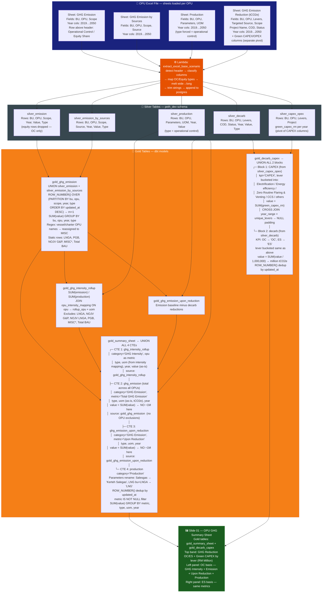

# Slide 01: OPU GHG Summary Sheet

/image1.jpg)

> **Gold tables:** `gold_summary_sheet` + `gold_decarb_capex`
> **Source sheets:** `GHG Emission`, `GHG Emission by Sources`, `Production`, `GHG Emission Reduction (tCO2e)`
> **dbt models:** `gold_summary_sheet.sql`, `gold_decarb_capex.sql`

---

## What This Slide Shows

A per-OPU full GHG summary with two panels (OC and ES basis):

| Section | Content |
| --- | --- |
| **Top band** | GHG Reduction Forecast + Green CAPEX by decarb lever (Zero Routine Flaring, Energy Efficiency, Electrification, CCS, Others) — OC and ES values + CAPEX in RM Million |
| **Left panel** | Total GHG Emission Forecast — Operational Control: GHG Intensity rows (Gas Processing, Utilities, Shipping) + Total GHG Emission line + Upon Reduction line + Production (LNG MMT, Kerteh Salesgas mmscfd) |
| **Right panel** | Same layout — Equity Share basis |

---

## Data Flow Diagram

---

## Gold Tables Used

| Table | Feeds |
| --- | --- |
| `gold_summary_sheet` | GHG Intensity rows, Total GHG Emission line, Upon Reduction line, Production rows (both OC and ES panels) |
| `gold_decarb_capex` | Top CAPEX band — OC/ES decarb lever totals in million tCO2e + CAPEX in RM Million |

---

## Calculation Logic

### `gold_summary_sheet`

| Step | Logic | Code Reference |
| --- | --- | --- |
| 1 | `ghg_intensity_rollup` CTE: intensity value as-is, uom from `opu_intensity_mapping` | `gold_summary_sheet.sql` L1–13 |
| 2 | `ghg_emission` CTE: `SUM(value)` — **no ÷1M** (raw tCO2e), metric = 'Total GHG Emission' | `gold_summary_sheet.sql` L14–31 |
| 3 | `ghg_emission_upon_reduction` CTE: `SUM(value)` from `gold_ghg_emission_upon_reduction` | `gold_summary_sheet.sql` L32–49 |
| 4 | `production` CTE: `ROW_NUMBER()` dedup, rename Parameters → metric (LNG/Kerteh Salegas), `SUM(value)` | `gold_summary_sheet.sql` L50–94 |
| 5 | Final `UNION ALL` of all 4 CTEs + `current_timestamp` | `gold_summary_sheet.sql` L95–115 |

### `gold_decarb_capex`

| Step | Logic | Code Reference |
| --- | --- | --- |
| 1 | `decarb` CTE: dedup silver_decarb, bucket levers (non-4 → 'others'), type OC/ES → KPI label, `SUM(value/1,000,000)` → million tCO2e | `gold_decarb_capex.sql` L1–34 |
| 2 | `capex` CTE: dedup silver_capex_opex, same lever bucketing, `SUM(green_capex_rm)` as CAPEX value | `gold_decarb_capex.sql` L35–65 |
| 3 | `year_range` × `unique_levers` CROSS JOIN → NULL padding for missing lever/year combos | `gold_decarb_capex.sql` L66–105 |
| 4 | `UNION ALL` CAPEX block + decarb block + `current_timestamp` | `gold_decarb_capex.sql` L106–110 |

---

## Source Files

| File | Role |
| --- | --- |
| `functions/extract_excel_base_scenario/lambda_handler.py` | Parses all 4 sheets, writes silver tables |
| `dbt_project/models/gold_table/gold_ghg_emission.sql` | Base emission gold layer |
| `dbt_project/models/gold_table/gold_ghg_intensity_rollup.sql` | Intensity = emission / production |
| `dbt_project/models/gold_table/gold_ghg_emission_upon_reduction.sql` | Emission after decarb reductions |
| `dbt_project/models/gold_table/gold_summary_sheet.sql` | UNION: intensity + emission + upon_reduction + production |
| `dbt_project/models/gold_table/gold_decarb_capex.sql` | UNION: CAPEX + decarb lever reductions |
| `functions/tableau_load/lambda_handler.py` | Pushes both gold tables to Tableau |

---

## Key Invariants

| # | Invariant | Code Reference |
| --- | --- | --- |
| 1 | `gold_summary_sheet` does **NOT** divide emission by 1,000,000 — raw tCO2e (unlike `gold_slide2_slide3`) | `gold_summary_sheet.sql` L20, L38 |
| 2 | `gold_decarb_capex` decarb values **DO** divide by 1,000,000 → million tCO2e | `gold_decarb_capex.sql` L24 |
| 3 | CAPEX CROSS JOIN pads NULL for any lever/year combination with no data | `gold_decarb_capex.sql` L91–104 |
| 4 | Production: `Salesgas Production` → renamed `Kerteh Salegas`; LNG (bu=LNGA) → `LNG` | `gold_summary_sheet.sql` L61–63 |
| 5 | Shipping OPUs reassigned to `MISC` in production CTE | `gold_summary_sheet.sql` L55–57 |
| 6 | All CTEs filtered by `scenario_id` + `user_email` dbt vars | throughout both SQL files |

---

## BRD Reference

- **BR-07.3**: Executive charts — Total GHG Emission Forecast, GHG Intensity Forecast, Upon Reduction.
- **BR-02**: Both Operational Control and Equity Share panels displayed.
- **BR-03**: Full decimal precision at silver; division to million tCO2e only at gold layer.
- **BR-06**: Green CAPEX by decarb lever shown in RM Million.
