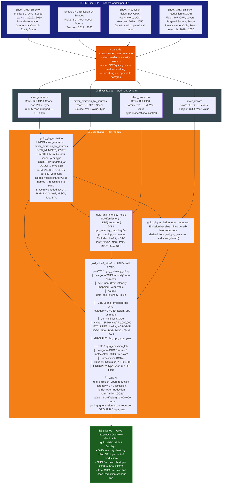

# Slide 02: GHG Executive Overview

/image2.png)

> **Gold table:** `gold_slide2_slide3`
> **Source sheets:** `GHG Emission`, `GHG Emission by Sources`, `Production`, `GHG Emission Reduction (tCO2e)`
> **dbt model:** `dbt_project/models/gold_table/gold_slide2_slide3.sql`

---

## Data Flow Diagram

---

## Gold Table Used

`gold_slide2_slide3` — UNION ALL of four CTEs over years 2019–2050, filtered by `scenario_id` and `user_email` dbt vars.

---

## Calculation Logic

| Step | Logic | Code Reference |
| --- | --- | --- |
| 1 | `gold_ghg_emission` = UNION `silver_emission` + `silver_emission_by_sources`, dedup by `ROW_NUMBER()` latest `updated_at` | `gold_ghg_emission.sql` L3–15 |
| 2 | `gold_ghg_intensity_rollup` = SUM(emission) / SUM(production), JOIN `opu_intensity_mapping` | `gold_ghg_intensity_rollup.sql` L49–82 |
| 3 | CTE `ghg_emission` per OPU: `SUM(value) / 1,000,000`, excludes LNGA, NOJV G&P, NOJV LNGA, PGB, MISC*, Total BAU | `gold_slide2_slide3.sql` L14–33 |
| 4 | CTE `ghg_emission_total`: `SUM(value) / 1,000,000` across all OPUs, metric = 'Total GHG Emission' | `gold_slide2_slide3.sql` L34–51 |
| 5 | CTE `ghg_emission_upon_reduction`: `SUM(value) / 1,000,000` from `gold_ghg_emission_upon_reduction`, metric = 'Upon Reduction' | `gold_slide2_slide3.sql` L52–69 |
| 6 | Final: `UNION ALL` all 4 CTEs + `current_timestamp as updated_at` | `gold_slide2_slide3.sql` L70–90 |

---

## Source Files

| File | Role |
| --- | --- |
| `functions/extract_excel_base_scenario/lambda_handler.py` | Parses all 4 Excel sheets, writes silver tables |
| `dbt_project/models/gold_table/gold_ghg_emission.sql` | First gold layer: UNION + dedup + OPU grouping |
| `dbt_project/models/gold_table/gold_ghg_intensity_rollup.sql` | Intensity = emission / production, per rollup OPU |
| `dbt_project/models/gold_table/gold_ghg_emission_upon_reduction.sql` | Emission after applying decarb reductions |
| `dbt_project/models/gold_table/gold_slide2_slide3.sql` | Final UNION ALL — 4 CTEs → Tableau |
| `dbt_project/models/sources.yml` | Registers all silver tables |
| `functions/tableau_load/lambda_handler.py` | Pushes `gold_slide2_slide3` to Tableau |

---

## Key Invariants

| # | Invariant | Code Reference |
| --- | --- | --- |
| 1 | Equity Share rows dropped at silver level — only `type = 'operational control'` persists | `lambda_handler.py` L363–364 |
| 2 | OPU per-row emission divided by 1,000,000 → unit = `million tCO2e` | `gold_slide2_slide3.sql` L20, L40, L58 |
| 3 | Per-OPU CTE excludes placeholder OPUs: LNGA, NOJV G&P, NOJV LNGA, PGB, MISC*, Total BAU | `gold_slide2_slide3.sql` L26 |
| 4 | Total and Upon Reduction CTEs have NO OPU exclusion — they sum all rows | `gold_slide2_slide3.sql` L34–51, L52–69 |
| 5 | All 4 CTEs filtered by `scenario_id` + `user_email` dbt vars | `gold_slide2_slide3.sql` L11, L24, L44, L62 |
| 6 | `updated_at = current_timestamp` stamped at materialisation time | `gold_slide2_slide3.sql` L71, L77, L83, L89 |

---

## BRD Reference

- **BR-07.3**: Executive charts included — Total GHG Emission Forecast, GHG Intensity Forecast.
- **BR-02**: Operational Control basis (equity rows excluded).
- **BR-03**: Full decimal precision maintained through silver; only divided at gold layer for display unit.

## Bug Fix Log

| Date | Issue | Resolution | Status |
| --- | --- | --- | --- |
| 2026-02-24 | **16.4M vs 11.96M Variance (2019)** | Refactored `gold_ghg_emission.sql` to remove `UNION ALL` double-counting and implement OPU rollup (GPU/GTR). | **Fixed** ✓ |
| 2026-02-24 | **Missing OPUs in Slide 3** | Added `GPU` and `GTR` rollup logic to ensure all hierarchical children are captured under canonical OPU names. | **Fixed** ✓ |
