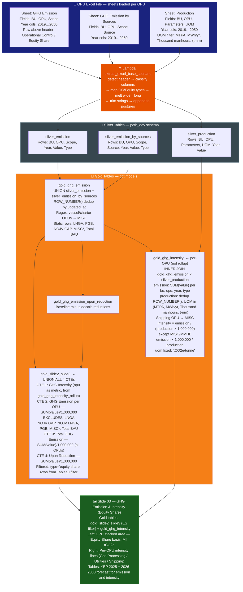

# Slide 03: GHG Emission & Intensity (Equity Share)

/image3.png)

> **Gold tables:** `gold_slide2_slide3` + `gold_ghg_intensity`
> **Source sheets:** `GHG Emission`, `GHG Emission by Sources`, `Production`
> **dbt models:** `gold_slide2_slide3.sql`, `gold_ghg_intensity.sql`

---

## What This Slide Shows

| Section | Content |
| --- | --- |
| **Left panel** | GHG Emission Profile — Equity Share: stacked area chart by individual OPU (MLNG, PFLNG1/2, ZLNG, GTR, GROWTH, MISC, NOJV G&P/LNGA, Total GHG Emission ES, Upon Reduction) — unit: Mil tCO2e |
| **Bottom-left table** | Existing Operation summary: YEP 2025 GHG Emission, BAU (without Reduction) 2026-2030, Upon GHG Reduction 2026-2030 |
| **Right panel** | GHG Intensity Profile — Equity Share: per rollup-OPU lines (Gas Business, LNGA, PLC, ZLNG, FFLNG192, Gas Processing, GLNG Operation/Upstream, LNGC) — units: Gas Processing tCO2e/tonne, Utilities tCO2e/MWh, Shipping gCO2e/t-nm |
| **Bottom-right table** | GHG Intensity forecast summary: YEP 2025 intensity + 2026-2030 forecast by rollup group |

---

## Data Flow Diagram

---

## Gold Tables Used

| Table | Feeds |
| --- | --- |
| `gold_slide2_slide3` | Left area chart (ES type filtered in Tableau) + Upon Reduction line + Total GHG Emission ES line |
| `gold_ghg_intensity` | Right intensity profile — per individual OPU, tCO2e/tonne |

---

## Calculation Logic

### `gold_ghg_intensity`

| Step | Logic | Code Reference |
| --- | --- | --- |
| 1 | `ghg_emission` CTE: `SUM(value)` from `gold_ghg_emission`, excludes LNGA, NOJV G&P, NOJV LNGA, PGB, MISC*, Total BAU | `gold_ghg_intensity.sql` L1–20 |
| 2 | `production` CTE: dedup `silver_production` via `ROW_NUMBER()`, filter UOM ∈ {MTPA, MWh/yr, Thousand manhours, (t-nm)}, shipping OPU → MISC | `gold_ghg_intensity.sql` L21–48 |
| 3 | JOIN emission × production on bu, opu, year, type | `gold_ghg_intensity.sql` L73–80 |
| 4 | Intensity = `ge.value / (p.value × 1,000,000)` — except MISC/MMHE: `ge.value × 1,000,000 / p.value` | `gold_ghg_intensity.sql` L57–67 |
| 5 | `uom` hardcoded to `'tCO2e/tonne'` for all rows | `gold_ghg_intensity.sql` L55 |

### `gold_slide2_slide3` (reused — see slide_02.md)

Tableau filters `type = 'equity share'` rows to populate the ES panel.

---

## Source Files

| File | Role |
| --- | --- |
| `functions/extract_excel_base_scenario/lambda_handler.py` | Parses sheets, writes silver tables |
| `dbt_project/models/gold_table/gold_ghg_emission.sql` | Base emission gold layer |
| `dbt_project/models/gold_table/gold_ghg_emission_upon_reduction.sql` | Upon reduction layer |
| `dbt_project/models/gold_table/gold_slide2_slide3.sql` | Emission + intensity UNION — ES filtered by Tableau |
| `dbt_project/models/gold_table/gold_ghg_intensity.sql` | Per-OPU intensity = emission / production |
| `dbt_project/models/sources.yml` | Registers all silver tables |

---

## Key Invariants

| # | Invariant | Code Reference |
| --- | --- | --- |
| 1 | `gold_ghg_intensity` uses **per-OPU** granularity (not rollup) — GLNG Operation, GLNG Upstream each shown separately | `gold_ghg_intensity.sql` L53–54 |
| 2 | MISC and MMHE intensity uses inverted scaling: `emission × 1,000,000 / production` | `gold_ghg_intensity.sql` L57–58, L65–66 |
| 3 | Production UOM filter restricts to facility types: MTPA, MWh/yr, manhours, t-nm | `gold_ghg_intensity.sql` L43 |
| 4 | `gold_slide2_slide3` same table as slide_02 — ES vs OC split done by Tableau filter, not separate gold tables | `gold_slide2_slide3.sql` (shared) |
| 5 | OPU stacked area excludes: LNGA, NOJV G&P, NOJV LNGA, PGB, MISC*, Total BAU | `gold_slide2_slide3.sql` L26 |

---

## BRD Reference

- **BR-07.3**: Executive charts — GHG Emission (Equity Share), GHG Intensity (Equity Share).
- **BR-02**: Equity Share basis for both panels.

---

## Suggestions

| # | Gap / Suggestion | Evidence | Impact |
| --- | --- | --- | --- |
| 1 | **`gold_ghg_intensity` and `gold_ghg_intensity_rollup` are separate models** — intensity per OPU vs intensity per rollup group. The distinction is undocumented in any feature doc. Consumers may confuse the two. | Two separate `.sql` files with different JOIN logic | Silent data confusion risk |
| 2 | **`uom` hardcoded to `tCO2e/tonne`** in `gold_ghg_intensity` regardless of actual unit — Utilities (MWh) and Shipping (t-nm) have different denominator units but the same uom label. Tableau likely overrides the display unit. | `gold_ghg_intensity.sql` L55 | UOM label is incorrect for Utilities and Shipping rows |
| 3 | **`project_sanction` is `null`** in `gold_slide4.sql` L88 — Growth project sanction date not populated from any source. Either not in Excel or mapping is missing. | `gold_slide4.sql` L88: `null as project_sanction` | Tableau shows blank column if consumed |

## Bug Fix Log

| Date | Issue | Resolution | Status |
| --- | --- | --- | --- |
| 2026-02-24 | **16.4M vs 11.96M Variance (2019)** | Refactored `gold_ghg_emission.sql` to remove `UNION ALL` double-counting and implement OPU rollup (GPU/GTR). | **Fixed** ✓ |
| 2026-02-24 | **Missing OPUs in Slide 3** | Added `GPU` and `GTR` rollup logic to ensure all hierarchical children are captured under canonical OPU names. | **Fixed** ✓ |
