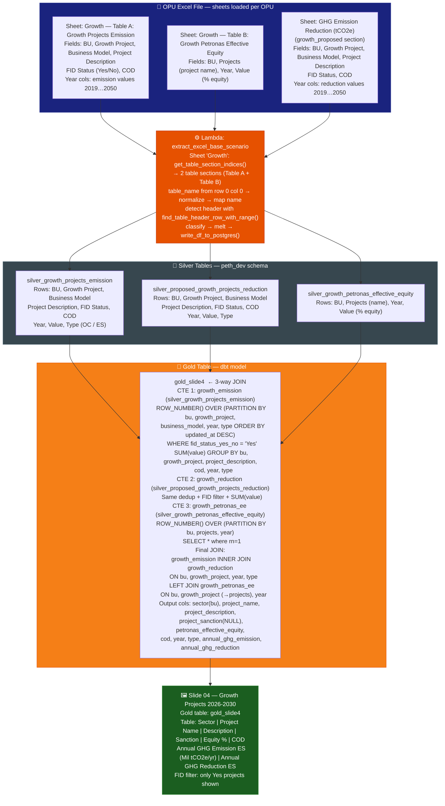

# Slide 04: Growth Projects 2026-2030

/image4.png)

> **Gold table:** `gold_slide4`
> **Source sheets:** `Growth` (Table A: Growth Projects Emission, Table B: Growth Petronas Effective Equity), `GHG Emission Reduction (tCO2e)` (growth_proposed_reduction)
> **dbt model:** `dbt_project/models/gold_table/gold_slide4.sql`

---

## What This Slide Shows

| Section | Content |
| --- | --- |
| **Full-page table** | Growth Projects 2026-2030 Listing: Sector (BU), Project Name, Project Description, Project Sanction, Petronas Effective Equity (%), COD, Annual GHG Emission (Equity Share, Mil tCO2e/year), Annual GHG Reduction (Equity Share, Mil tCO2e/year) |
| **Rows** | One row per growth project × year (e.g. Tango, Peony, Calathea, Silica, Asters, Rancha for G&P; Suriname F2 for LNGA) — FID Status = Yes only |

---

## Data Flow Diagram

---

## Gold Table Used

`gold_slide4` — 3-way JOIN: growth emission × growth reduction × petronas effective equity.
Only FID = Yes projects included. `project_sanction` is always `NULL` (not sourced from Excel).

---

## Calculation Logic

| Step | Logic | Code Reference |
| --- | --- | --- |
| 1 | `growth_emission` CTE: dedup `silver_growth_projects_emission` via `ROW_NUMBER()`, filter `fid_status_yes_no = 'Yes'`, `SUM(value)` per project + year + type | `gold_slide4.sql` L1–34 |
| 2 | `growth_reduction` CTE: same dedup + FID filter on `silver_proposed_growth_projects_reduction`, `SUM(value)` | `gold_slide4.sql` L35–68 |
| 3 | `growth_petronas_ee` CTE: dedup `silver_growth_petronas_effective_equity` via `ROW_NUMBER()`, SELECT * where rn=1 | `gold_slide4.sql` L69–83 |
| 4 | Final INNER JOIN: `growth_emission` JOIN `growth_reduction` on bu, growth_project, year, type, scenario_id, user_email | `gold_slide4.sql` L96–103 |
| 5 | LEFT JOIN `growth_petronas_ee` on bu, growth_project → projects, year, scenario_id, user_email | `gold_slide4.sql` L104–109 |
| 6 | `project_sanction` hardcoded `null` — not available from any source | `gold_slide4.sql` L88 |

---

## Source Files

| File | Role |
| --- | --- |
| `functions/extract_excel_base_scenario/lambda_handler.py` | Parses Growth sheet multi-table sections + GHG Reduction sheet |
| `dbt_project/models/gold_table/gold_slide4.sql` | 3-way JOIN — growth emission + reduction + Petronas equity |
| `dbt_project/models/sources.yml` | Registers silver_growth_projects_emission, silver_proposed_growth_projects_reduction, silver_growth_petronas_effective_equity |

---

## Key Invariants

| # | Invariant | Code Reference |
| --- | --- | --- |
| 1 | Only FID = `'Yes'` projects included — pre-FID/concept projects excluded | `gold_slide4.sql` L25, L59 |
| 2 | INNER JOIN emission + reduction — project must exist in both silvers or row is dropped | `gold_slide4.sql` L96–103 |
| 3 | `petronas_effective_equity` may be `NULL` if project absent from equity table (LEFT JOIN) | `gold_slide4.sql` L104 |
| 4 | `project_sanction` always `NULL` — column reserved but not populated | `gold_slide4.sql` L88 |
| 5 | Both emission and reduction deduplicated separately before JOIN | `gold_slide4.sql` L2–11, L36–45 |

---

## BRD Reference

- **BR-08**: Growth projects — FID-approved only; Petronas Effective Equity % sourced from SBD Integrated Portfolio Team.
- **BR-05**: Scenario-filtered (scenario_id + user_email vars).

---

## Suggestions

| # | Gap / Suggestion | Evidence | Impact |
| --- | --- | --- | --- |
| 1 | **`project_sanction` always NULL** — column exists in output schema but no Excel source populates it. Either the source field was never added to the Growth sheet, or it comes from a separate system (SBD portal). | `gold_slide4.sql` L88: `null as project_sanction` | Blank column in Tableau slide |
| 2 | **`business_model` in dedup partition key but not in SELECT** — used for dedup uniqueness but dropped from final output. If projects differ only by business model, the row is correctly deduped but business model visibility is lost. | `gold_slide4.sql` L5, L39 vs L12–33 | Silent dimension drop |
| 3 | **INNER JOIN may silently drop projects** — if a growth project exists in `silver_growth_projects_emission` but not in `silver_proposed_growth_projects_reduction`, it is excluded from the slide with no error. | `gold_slide4.sql` L96–103 | Data loss without alert |
| 4 | **Equity % data source not in the pipeline** — slide references SBD Integrated Portfolio Team as source. Confirm whether `silver_growth_petronas_effective_equity` is populated from the same Excel or a separate manual upload. | References footnote on image | Provenance gap |
