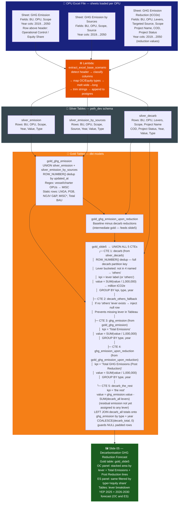

# Slide 05: Decarbonisation Projects GHG Reduction Forecast

/image5.jpg)

> **Gold table:** `gold_slide5`
> **Source sheets:** `GHG Emission`, `GHG Emission by Sources`, `GHG Emission Reduction (tCO2e)`
> **dbt models:** `gold_slide5.sql`, `gold_ghg_emission.sql`, `gold_ghg_emission_upon_reduction.sql`

---

## What This Slide Shows

| Section | Content |
| --- | --- |
| **Left panel** | GHG Reduction Forecast — Operational Control: stacked waterfall area by decarb lever (Zero Flaring & Venting, Energy Efficiency, Electrification, CCS, Others, the rest) + Total Emissions line + Total GHG Emissions (Post Reduction) line — unit: Mil tCO2e |
| **Right panel** | Same — Equity Share basis |
| **Bottom-left table** | OC lever breakdown: YEP 2025 GHG Reduction + 2026-2030 forecast by lever (GHG Reduction, Zero Flaring, Energy Efficiency, Electrification, CCS, Others) |
| **Bottom-right table** | Same — ES basis |

---

## Data Flow Diagram

---

## Gold Table Used

`gold_slide5` — UNION ALL of 5 CTEs: decarb by lever + others fallback + total emissions + post-reduction + residual "the rest".

---

## Calculation Logic

| Step | Logic | Code Reference |
| --- | --- | --- |
| 1 | `decarb` CTE: dedup `silver_decarb` full partition key, bucket levers (not in 4 named → 'others'), `SUM(value/1,000,000)` per lever + type + year | `gold_slide5.sql` L1–31 |
| 2 | `decarb_others_fallback` CTE: if no 'others' rows exist in `decarb`, inject `null::float` rows to prevent Tableau missing lever | `gold_slide5.sql` L32–45 |
| 3 | `ghg_emission` CTE: from `gold_ghg_emission`, kpi='Total Emissions', `SUM(value/1,000,000)` | `gold_slide5.sql` L46–62 |
| 4 | `ghg_emission_upon_reduction` CTE: from `gold_ghg_emission_upon_reduction`, kpi='Total GHG Emissions (Post Reduction)', `SUM(value/1,000,000)` | `gold_slide5.sql` L63–79 |
| 5 | `decarb_all` = `decarb` UNION ALL `decarb_others_fallback` | `gold_slide5.sql` L80–84 |
| 6 | `decarb_the_rest` CTE: `ghg_emission.value - COALESCE(SUM(decarb_all),0)` — residual emission after lever assignments | `gold_slide5.sql` L85–104 |
| 7 | Final UNION ALL: `decarb_all` + `decarb_the_rest` + `ghg_emission` + `ghg_emission_upon_reduction` | `gold_slide5.sql` L105–123 |

---

## Source Files

| File | Role |
| --- | --- |
| `functions/extract_excel_base_scenario/lambda_handler.py` | Parses all 3 sheets, writes silver tables |
| `dbt_project/models/gold_table/gold_ghg_emission.sql` | Base emission layer |
| `dbt_project/models/gold_table/gold_ghg_emission_upon_reduction.sql` | Post-reduction baseline |
| `dbt_project/models/gold_table/gold_slide5.sql` | UNION of 5 CTEs — lever breakdown + residual + totals |
| `dbt_project/models/sources.yml` | Registers silver_emission, silver_emission_by_sources, silver_decarb |

---

## Key Invariants

| # | Invariant | Code Reference |
| --- | --- | --- |
| 1 | Lever bucketing identical to `gold_decarb_capex` — 4 named levers + 'others' catchall | `gold_slide5.sql` L14–17 |
| 2 | `decarb_others_fallback` injects `null` value (not zero) if no 'others' lever present — Tableau must handle NULL | `gold_slide5.sql` L32–45 |
| 3 | `decarb_the_rest` residual can be **negative** if lever reductions exceed total emission for a year | `gold_slide5.sql` L90 |
| 4 | OC vs ES split done by Tableau filter on `type` column — same gold table serves both panels | `gold_slide5.sql` L18 |
| 5 | All values divided by 1,000,000 → million tCO2e (consistent for all 5 CTEs) | `gold_slide5.sql` L21, L51, L68 |
| 6 | `methane_project_yes_no` in dedup partition key but not in SELECT | `gold_slide5.sql` L5 |

---

## BRD Reference

- **BR-07.3**: Decarbonisation forecast — OC and ES panels.
- **BR-09**: Lever taxonomy — 4 named levers (ZRF, Energy Efficiency, Electrification, CCS) + others.
- **BR-05**: Scenario-filtered (scenario_id + user_email).

---

## Suggestions

| # | Gap / Suggestion | Evidence | Impact |
| --- | --- | --- | --- |
| 1 | **`decarb_the_rest` can go negative** — if lever reductions exceed total emission in a given year, the residual becomes negative. No guard or WARNING is raised. This produces a downward waterfall bar that may confuse chart readers. | `gold_slide5.sql` L90: `e.value - coalesce(d.decarb_total, 0)` | Negative waterfall bar possible |
| 2 | **`decarb_others_fallback` injects NULL not 0** — Tableau must treat NULL as zero in SUM. If Tableau excludes NULLs, the row renders as a gap in the chart. Should be `0::float` for safety. | `gold_slide5.sql` L37: `null::float as value` | Potential missing lever bar in Tableau |
| 3 | **`methane_project_yes_no` in partition key, not in SELECT** — same as `gold_decarb_capex`. Methane project dimension silently dropped. | `gold_slide5.sql` L5 | Dimension invisible in outputs |
| 4 | **OC vs ES panel uses same gold table** — Tableau applies a `type` filter for each panel. If Tableau filter is misconfigured, both panels could show the same data. A gold model split by type would be safer. | Single `type` column in output | Tableau misconfiguration risk |
