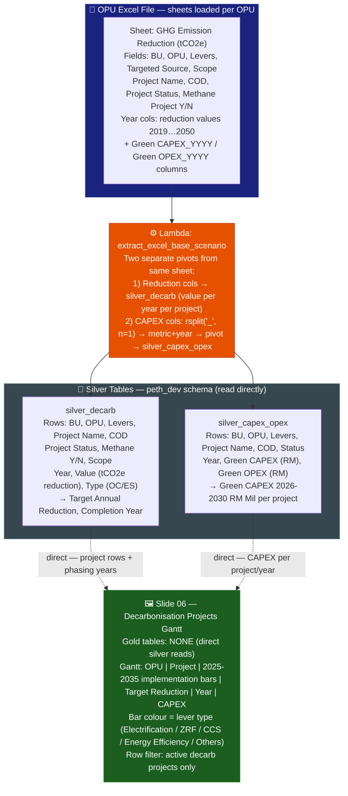

# Slide 06: Decarbonisation Projects Gantt

/image6.png)

> **Gold tables:** NONE — reads `silver_decarb` + `silver_capex_opex` directly
> **Source sheet:** `GHG Emission Reduction (tCO2e)`
> **dbt model:** None (direct silver read for project-level Gantt)

---

## What This Slide Shows

| Section | Content |
| --- | --- |
| **Gantt table** | Per-project decarbonisation timeline: OPU, Project Name, year-phased bars 2025-2035 (implementation window per lever type), Target Annual Reduction (Mil tCO2e), Target Completion Year, Green CAPEX 2026-2030 (RM Mil) |
| **Legend** | Bar colour = lever type: Zero Routine Flaring (dark), Energy Efficiency (green), Electrification (purple), CCS/CCUS (blue), As-per-planned FY2025(yellow), Re-baselined (orange), As-per-approved P4R 2025-2030 (grey) |
| **Rows** | LNGA: PLC (Glory Phase 1/2, CCS Azolla), PFLNG (Seal Gas Purifier, Exapilot), GLNG (CIE, BESS, CO2 Vent); G&P: GPU (SIPRO, Pat GEN, FLEXE1A, DPCU3 FLAMINGO, etc.), GTR, PGB (CCS Anthurium, BOG Recovery, E-Hydrocom) |

---

## Data Flow Diagram

---

## Gold Table Used

**NONE.** This slide reads `silver_decarb` and `silver_capex_opex` directly at project row level. No dbt gold aggregation is applied — individual project names, CODs, and year-phased CAPEX values are preserved as-is.

---

## Calculation Logic

| Step | Logic | Code Reference |
| --- | --- | --- |
| 1 | `silver_decarb` loaded from GHG Reduction sheet — reduction value per project × year × type | `lambda_handler.py` L~550-620 |
| 2 | `silver_capex_opex` pivoted from same sheet — `rsplit('_', n=1)` splits `Green CAPEX_2026` → metric + year | `lambda_handler.py` L624 |
| 3 | Gantt bar spans from project start year to `commercial_operation_date` (COD) | `silver_decarb.commercial_operation_date` |
| 4 | Target Annual Reduction = max `value` of the project (or Tableau SUM for a reference year) | `silver_decarb.value` |
| 5 | Green CAPEX 2026-2030 = SUM of `green_capex_rm` per project across those years | `silver_capex_opex.green_capex_rm` |

---

## Source Files

| File | Role |
| --- | --- |
| `functions/extract_excel_base_scenario/lambda_handler.py` | Dual pivot from GHG Reduction sheet → silver_decarb + silver_capex_opex |
| `dbt_project/models/sources.yml` | Registers silver_decarb and silver_capex_opex as sources |

---

## Key Invariants

| # | Invariant | Code Reference |
| --- | --- | --- |
| 1 | No dbt gold model — Tableau reads silver tables directly for this slide | (no gold SQL file) |
| 2 | Same sheet feeds both silver tables — decarb reduction values + CAPEX pivot | `lambda_handler.py` L622–654 |
| 3 | `project_status` column carries labels like 'UPDATED', 'NEW' (visible in slide badges) | `silver_decarb.project_status` |
| 4 | Grey-out rows in slide indicate de-scoped / as-per-approved P4R 2025-2030 projects | Tableau colour filter on `project_status` |

---

## BRD Reference

- **BR-06**: Green CAPEX per decarbonisation project, registered with FAB Corporate.
- **BR-09**: Lever taxonomy used for bar colour coding.

---

## Suggestions

| # | Gap / Suggestion | Evidence | Impact |
| --- | --- | --- | --- |
| 1 | **No gold model means no dedup** — `silver_decarb` may contain duplicate rows if the same file is re-uploaded. Tableau reads raw silver; duplicates inflate reduction values in the Gantt. `gold_decarb_capex` deduplicates but is not used here. | Direct silver read with no `ROW_NUMBER()` applied | Potential data duplication |
| 2 | **`project_status` label logic is Tableau-side** — 'UPDATED', 'NEW' badges and grey-out logic depend on Tableau calculated fields or colour encodings not captured in the pipeline. | Image shows badge labels; no SQL equivalent | Undocumented Tableau logic |
| 3 | **Year range 2025-2035 in Gantt** — `silver_decarb` stores values 2019-2050, but only 2025-2035 are displayed. Year filter is Tableau-side. No documentation of this filter exists in the pipeline. | Image x-axis vs silver schema | Silent display filter |
