# Slide 07: Green CAPEX Decarbonisation Projects

/image7.png)

> **Gold tables:** `gold_decarb_capex` + `gold_slide7_project_table`
> **Source sheet:** `GHG Emission Reduction (tCO2e)` (for both silver_decarb and silver_capex_opex)
> **dbt models:** `gold_decarb_capex.sql`, `gold_slide7_project_table.sql`

---

## What This Slide Shows

| Section | Content |
| --- | --- |
| **Top band** | GHG Reduction Forecast + Green CAPEX by decarb lever (Zero Routine Flaring, Energy Efficiency, Electrification, CCS, Others) — OC/ES in Mil tCO2e + CAPEX in RM Million |
| **Bottom left** | FY2026-2030 Green CAPEX bar chart — stacked by BU (G&P, LNGA), unit: RM '000,000 |
| **Bottom right** | Project-level CAPEX phasing table — Sector, OPU, Project name, CAPEX (RM) per year 2026–2030 + Total 5-Year |

---

## Data Flow Diagram

```mermaid
flowchart TD

    subgraph EXCEL["📄 OPU Excel File — sheets loaded per OPU"]
        SH1["Sheet: GHG Emission Reduction (tCO2e)
Fields: BU, OPU, Levers, Targeted Source, Scope
Project Name, COD, Project Status
Year cols: 2019…2050  ← decarb reduction values
+ Green CAPEX YYYY / Green OPEX YYYY columns
  (separate pivot: id_cols + year → Green CAPEX, Green OPEX)"]
    end

    subgraph TRANSFORM["⚙️ Lambda: extract_excel_base_scenario
Sheet: GHG Emission Reduction (tCO2e)
Step 1: detect header, classify columns
Step 2: melt year cols → silver_decarb (reduction values)
Step 3: split Green CAPEX_YYYY headers → metric + year
Step 4: pivot metric → columns Green CAPEX / Green OPEX
→ write silver_capex_opex (project + year + CAPEX + OPEX)"]
    end

    subgraph SILVER["🥈 Silver Tables — peth_dev schema"]
        SD["silver_decarb
Rows: BU, OPU, Levers, Targeted Source, Scope
Project Name, COD, Project Status
Year, Value, Type (OC / ES)"]
        SCO["silver_capex_opex
Rows: BU, OPU, Levers, Project Name, COD, Status
Year, Green CAPEX (RM), Green OPEX (RM)
(one row per project × year)"]
    end

    subgraph GOLD["🥇 Gold Tables — dbt models"]
        GDC["gold_decarb_capex  ← UNION ALL 2 blocks
┌─ Block 1: CAPEX (source: silver_capex_opex)
│  kpi = 'CAPEX'
│  Lever bucketed: Electrification / Energy efficiency /
│  Zero Routine Flaring & Venting / CCS / others
│  value = SUM(green_capex_rm)
│  ROW_NUMBER() dedup by updated_at
│  CROSS JOIN year_range × unique_levers → NULL padding
│  for lever/year combos with no project
│
└─ Block 2: decarb (source: silver_decarb)
   KPI: type='operational control' → 'OC'
        type='equity share' → 'ES'
   Lever bucketed same as above
   value = SUM(value / 1,000,000) → million tCO2e
   ROW_NUMBER() dedup by updated_at
   GROUP BY KPI, lever, year"]

        GSPT["gold_slide7_project_table
Deduplicates silver_capex_opex
Maps: project_name → project, bu → sector
Derives: Color (White if value > 0, else Blue)
Filters: years 2026-2030"]
    end

    SH1 --> TRANSFORM
    TRANSFORM --> SD & SCO
    SD & SCO --> GDC
    SCO --> GSPT

    GDC --> SLIDE
    GSPT --> SLIDE["🖼️ Slide 07 — Green CAPEX Decarbonisation Projects
Gold tables: gold_decarb_capex + gold_slide7_project_table
Top band: OC / ES Mil tCO2e + CAPEX RM Mil per lever
Bar chart: FY2026-2030 CAPEX stacked by BU (G&P, LNGA) RM 000,000
Table: Sector | OPU | Project | 2026-2030 CAPEX (RM) | Total 5-Year"]

    style SLIDE fill:#1B5E20,color:#fff,stroke:#388E3C
    style EXCEL fill:#1A237E,color:#fff,stroke:#283593
    style TRANSFORM fill:#E65100,color:#fff,stroke:#BF360C
    style SILVER fill:#37474F,color:#fff,stroke:#546E7A
    style GOLD fill:#F57F17,color:#fff,stroke:#E65100
```





---

## Gold Table Used

| Table | Feeds |
| --- | --- |
| `gold_decarb_capex` | Top band (OC/ES lever totals + CAPEX RM Mil) + FY2026-2030 stacked bar chart |
| `gold_slide7_project_table` | Project-level CAPEX phasing table (Sector, OPU, Project, Year, Value, Color) |

---

## Calculation Logic

### `gold_decarb_capex`

| Step | Logic | Code Reference |
| --- | --- | --- |
| 1 | Dedup `silver_decarb` via `ROW_NUMBER()` OVER (PARTITION BY bu, opu, levers, project_name, COD, status, year, type ORDER BY updated_at DESC) | `gold_decarb_capex.sql` L2–13 |
| 2 | Bucket levers: not in (Electrification, Energy efficiency, Zero Routine Flaring & Venting, CCS) → `'others'` | `gold_decarb_capex.sql` L18–21 |
| 3 | Map type → KPI label: `'operational control'` → `'OC'`, `'equity share'` → `'ES'` | `gold_decarb_capex.sql` L14–17 |
| 4 | `SUM(value / 1,000,000)` → million tCO2e per KPI + lever + year | `gold_decarb_capex.sql` L24 |
| 5 | Dedup `silver_capex_opex` via `ROW_NUMBER()`, `SUM(green_capex_rm)` per lever + year | `gold_decarb_capex.sql` L35–65 |
| 6 | CROSS JOIN `year_range × unique_levers` with LEFT JOIN capex → `COALESCE(value, null)` for missing combos | `gold_decarb_capex.sql` L91–104 |
| 7 | `UNION ALL` CAPEX block + decarb block + `current_timestamp` | `gold_decarb_capex.sql` L106–110 |

### `silver_capex_opex` (project phasing table — direct)

| Step | Logic | Code Reference |
| --- | --- | --- |
| 1 | Lambda splits `GHG Emission Reduction` sheet: CAPEX/OPEX columns parsed separately from reduction columns | `lambda_handler.py` L622–636 |
| 2 | Column header format: `Green CAPEX_2026` → `str.rsplit('_', n=1)` → `metric='Green CAPEX'`, `year='2026'` | `lambda_handler.py` L624 |
| 3 | Pivot: `index=[id_cols + year], columns='metric', values='amount'` → one column per metric (Green CAPEX, Green OPEX) | `lambda_handler.py` L632–636 |
| 4 | Table shows project rows directly: BU/Sector, OPU, Project Name, CAPEX by year, Sum as Total 5-Year | `lambda_handler.py` L646–654 |

---

## Source Files

| File | Role |
| --- | --- |
| `functions/extract_excel_base_scenario/lambda_handler.py` | Splits GHG Reduction sheet → silver_decarb (values) + silver_capex_opex (CAPEX pivot) |
| `dbt_project/models/gold_table/gold_decarb_capex.sql` | Aggregates decarb + CAPEX by lever with NULL padding |
| `dbt_project/models/sources.yml` | Registers silver_decarb and silver_capex_opex |
| `functions/tableau_load/lambda_handler.py` | Pushes gold_decarb_capex to Tableau; silver_capex_opex read directly for project table |

---

## Key Invariants

| # | Invariant | Code Reference |
| --- | --- | --- |
| 1 | CAPEX CROSS JOIN pads NULL for any lever/year with no project data | `gold_decarb_capex.sql` L91–104 |
| 2 | Decarb values divided by 1,000,000 at gold layer → million tCO2e | `gold_decarb_capex.sql` L24 |
| 3 | Lever `'others'` = all levers NOT in the 4 named categories | `gold_decarb_capex.sql` L19–21 |
| 4 | Project phasing table uses `silver_capex_opex` directly — project names and per-year CAPEX not aggregated | `lambda_handler.py` L646 |
| 5 | Column split uses `rsplit('_', n=1)` — handles levers with underscores in their name | `lambda_handler.py` L624 |
| 6 | Both silver tables filtered by `scenario_id` + `user_email` | `gold_decarb_capex.sql` L11–12, L46–47 |

---

## BRD Reference

- **BR-06**: Green CAPEX by decarbonisation lever — registered with Finance at Business (FAB) Corporate.
- **BR-05**: Scenario-filtered outputs (scenario_id + user_email vars).
- **BR-04**: File path lineage — each silver row traces to the source S3 object.
- **BR-07**: DA-formatted output for project phasing table (gold_slide7_project_table).

---

## DA Expected Output — Project Phasing Table

**Source file:** `docs/DA_wanted_format/Data (Slide 7)_Data.csv`

This is the **ground-truth schema** the DA expects Tableau to consume for the bottom-right project table.

### Required schema

| Column | Type | Source | Notes |
| --- | --- | --- | --- |
| `Color` | string | Derived | `'White'` = active (value > 0), `'Blue'` = project complete/zero CAPEX |
| `OPU` | string | `silver_capex_opex.opu` | Direct |
| `Project` | string | `silver_capex_opex.project_name` | Direct |
| `Sector` | string | `silver_capex_opex.bu` | Display alias for `bu` |
| `Year` | int | `silver_capex_opex.year` | 2026-2030 |
| `Value` | float | `silver_capex_opex.green_capex_rm` | RM units (not divided by 1,000,000) |

### Sample rows from CSV

```csv
Color,OPU,Project,Sector,Year,Value
White,PLC,Glory Phase 1,LNGA,2026,576792
White,GLNG,Reservior CO2 Vent Industrial Offtaker (on-island),LNGA,2026,906266
White,GPU,CCS Anthurium (FEED),G&P,2026,1071816
Blue,GPU,CCS Anthurium (FEED),G&P,2029,0
Blue,GPU,F2N2,G&P,2030,0
```

### `Color` derivation logic

| Color | Condition | Observed in CSV |
| --- | --- | --- |
| `White` | `green_capex_rm > 0` | Rows 2026-2028 for all projects; 2029-2030 for LNGA projects |
| `Blue` | `green_capex_rm = 0` | GPU projects (CCS Anthurium, F2N2, FLAMINGO) in 2029-2030 only |

> Blue rows = projects that have **completed** their CAPEX spend by year N but still appear in the table (zero CAPEX, still active). This is a display state, not a filter — the row is kept with `value = 0`.

### Schema gap analysis

| Required column | Current `silver_capex_opex` column | Gap |
| --- | --- | --- |
| `Color` | ❌ absent | Must be **derived** — `CASE WHEN green_capex_rm = 0 THEN 'Blue' ELSE 'White' END`. Currently not in any gold model or silver table. |
| `Project` | `project_name` ✓ | Present, different column name only |
| `Sector` | `bu` ✓ | Present, Tableau alias only |
| `Year` | `year` ✓ | Present |
| `Value` | `green_capex_rm` ✓ | Present — DA expects raw RM, not ÷ 1,000,000 |

### What needs to be built

A **new gold model** (e.g. `gold_slide7_capex_table.sql`) or extension to `silver_capex_opex` that:

1. Deduplicates via `ROW_NUMBER()` (same partition key as `gold_decarb_capex` capex CTE)
2. Adds `Color` column: `CASE WHEN green_capex_rm = 0 THEN 'Blue' ELSE 'White' END`
3. Maps `bu` → `sector` (alias only)
4. Maps `project_name` → `project` (alias only)
5. Filters years 2026-2030
6. Outputs: `color, opu, project, sector, year, value (green_capex_rm)`

---

## Suggestions

> Items below are gaps or improvement opportunities identified from the image and code — not yet implemented.

| # | Gap / Suggestion | Evidence | Impact |
| --- | --- | --- | --- |
| 1 | **`green_opex_rm` is a dead column** | `grep green_opex *.sql` → 0 results | Data collected but invisible |
| 2 | **"Total 5-Year" column is undocumented** | Image shows column; no SQL equivalent found | Silent Tableau logic |
| 3 | **`methane_project_yes_no` in dedup key but never selected** | `gold_decarb_capex.sql` L5 | Silent business dimension lost |
| 4 | **`scope` dimension dropped in lever summary** | `gold_decarb_capex.sql` L5 vs L29–33 | Future extensibility gap |
