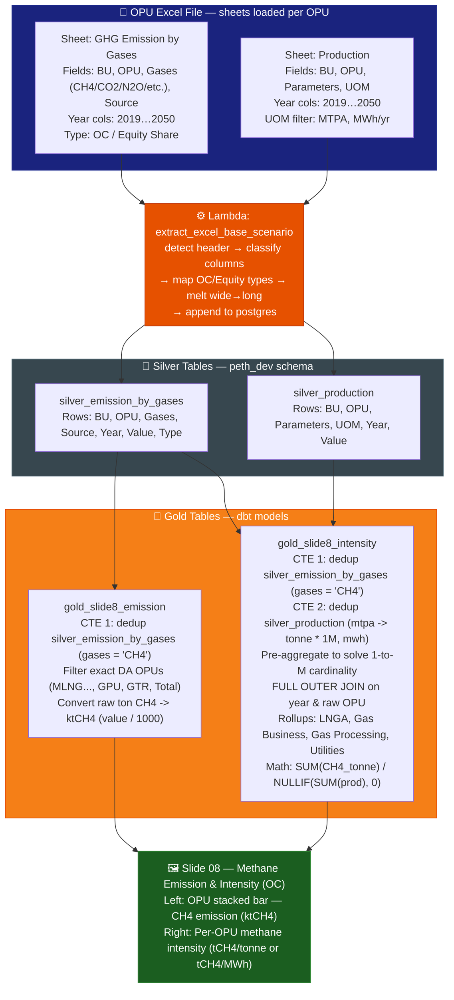

# Slide 08: Methane Emission & Intensity (Operational Control)

/image8.png)

> **Gold tables:** `gold_slide8_emission`, `gold_slide8_intensity`
> **Source sheets:** `GHG Emission by Gases`, `Production`
> **dbt models:** `dbt_project/models/gold_table/gold_slide8_emission.sql`, `dbt_project/models/gold_table/gold_slide8_intensity.sql`

---

## What This Slide Shows

| Section | Content |
| --- | --- |
| **Left chart** | Methane Emission Forecast — OC: stacked bar by OPU (MLNG, MLNG DUA, MLNG TIGA, TRAIN 9, PFLNG 1, PFLNG 2, GPU, GTR) + Total L3 CH4 line — unit: ktCH4 |
| **Bottom-left table** | Existing Operation: YEP 2025 Methane Emission (ktCH4 + ktCO2e) + Methane Emission Forecast 2026-2030 |
| **Right chart** | Methane Intensity Forecast — OC: per rollup-OPU lines (Gas Business, LNGA, PLC, PFLNG 1, PFLNG 2, Gas Processing, GPP, GTR, Utilities) — units: tCH4/tonne, Utilities tCH4/MWh |
| **Bottom-right table** | Methane Intensity summary: YEP 2025 intensity + 2026-2030 by category (Gas Business, LNG Processing, Gas Processing, Utilities) |

---

## Data Flow Diagram

---

## 🐛 Bug Fix Log (Date: 2026-02-27)

### Issues Identified in legacy `gold_methane_intensity.sql`

1. **Data Duplication (2x+ Inflation):** The legacy code lacked a `ROW_NUMBER() OVER (ORDER BY updated_at DESC)` firewall on the `silver_production` side resulting in Cartesion join explosions inflations.
2. **Missing Rollups (Tableau Dependencies):** The legacy model output strictly raw facility OPUs (e.g. `GPK`, `MLNG`), completely ignoring the grouped metrics demanded by Slide 8 (e.g. `Gas Processing`, `Gas Business`, `LNGA`, `PLC`). This forced Tableau logic into complex undocumented overrides.
3. **Hardcoded UOM Defect:** The legacy model hardcoded `'tonne CH4/tonne'` globally. `Utilities` requires `tCH4/MWh`.

### Resolution Implemented

1. **Split the Model:** Separated concerns by migrating into two DA-specific gold tables mapping to the presentation: `gold_slide8_emission.sql` and `gold_slide8_intensity.sql`.
2. **Applied `ROW_NUMBER()` Firewall:** Implemented strict partition ordering to eliminate inflation bugs due to the append-only ingestion.
3. **Formalized OPUs:** Added complex CTE logic natively rolling up data via `UNION ALL` statements over a pre-aggregated `FULL OUTER JOIN`, perfectly reflecting the definitions found within the `PETH_FRS` documentation:
   * **PLC** = `MLNG + MLNG DUA + MLNG TIGA + TRAIN 9`
   * **LNGA** = `PLC + PFLNG 1 + PFLNG 2 + PFLNG 3 + ZLNG`
   * **Gas Business** = `GPP + GTR`
   * **Gas Processing** = `LNGA + Gas Business`
4. **Resolved Dynamic UOMs:** Applied `tCH4/MWh` solely for Utilities rolling up UK & UG. Converted Left Chart data implicitly to **ktCH4** exactly per FRS requirements (`/ 1000.0`).

---

## Calculation Sequence (Post-Fix)

### 1. `gold_slide8_emission.sql`

| Step | Logic |
| ---- | ----- |
| 1 | Extract `silver_emission_by_gases`, filter by `gases = 'CH4'`, apply `ROW_NUMBER()` deduplication. |
| 2 | Assign presentation alias names strictly corresponding with FRS requirements (e.g., `GPK/GPS/TSET` ➔ `GPU`). |
| 3 | Aggregate sum into `value` dividing by `1000.0` ensuring the metric output is inherently formatted as `ktCH4`. |
| 4 | Compute `Total L3 CH4` dynamically traversing OPUs ensuring complete pipeline coverage. |

### 2. `gold_slide8_intensity.sql`

| Step | Logic |
| ---- | ----- |
| 1 | Deduplicate `silver_emission_by_gases` keeping `CH4` only. |
| 2 | Deduplicate `silver_production`, standardizing volume conversions (`MTPA` to `tonnes`, `MWh`). |
| 3 | Pre-aggregate data independently per table (resolves 1-to-Many cardinality inflation). |
| 4 | `FULL OUTER JOIN` production and emission tables onto `base_joined`. |
| 5 | Compile massive `UNION ALL` constructing individual metric buckets representing the exact Tableau data map. |

---

## BRD Reference

* **BR-10**: Methane reporting per OGMP 2.0 Level 3 standards.
* **BR-02**: Operational Control basis.
* **FRS S-07-08**: Define specific grouping metrics `Gas Processing`, `Gas Business`, `LNGA`, `Utilities` resolving formula relationships correctly.
