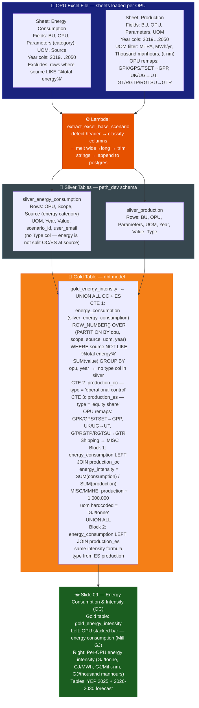

# Slide 09: Energy Consumption & Intensity (Operational Control)

/image9.png)

> **Gold table:** `gold_energy_intensity`
> **Source sheets:** `Energy Consumption`, `Production`
> **dbt model:** `dbt_project/models/gold_table/gold_energy_intensity.sql`

---

## What This Slide Shows

| Section | Content |
| --- | --- |
| **Top-left chart** | Energy Consumption Forecast — OC: stacked bar by OPU (PLC, PFLNG1/2, GTR, UT, MISC) + Total Energy line + LNG/Gas/Utilities Production reference lines — unit: Mill GJ per year |
| **Bottom-left chart** | Breakdown by Energy Category (%): Stationary Combustion, Electricity Import, Internal Energy Recovery, Renewable Energy |
| **Bottom-left table** | Existing Operation: YEP 2025 Energy Consumption + Forecast 2026-2030 (Mill GJ) |
| **Right chart** | Energy Intensity Forecast — OC: per rollup-OPU lines (Gas Business, PLC, PFLNG1/2, ZLNG, GPP, GTR, Utilities, Shipping, MMHE) — units: Gas Processing GJ/tonne, Utilities GJ/MWh, Shipping GJ/Mil t-nm, MMHE GJ/thousands manhours |
| **Bottom-right table** | Energy Intensity summary: YEP 2025 intensity + 2026-2030 by category (LNG/Gas Processing, Utilities, Shipping, MMHE) |

---

## Data Flow Diagram





---

## Gold Table Used

`gold_energy_intensity` — UNION ALL of OC and ES blocks: energy consumption (no type) LEFT JOINed to production split by OC and ES.

---

## Calculation Logic

| Step | Logic                                                                                                                                              | Code Reference                        |
| ---- | -------------------------------------------------------------------------------------------------------------------------------------------------- | ------------------------------------- |
| 1    | `energy_consumption` CTE: dedup `silver_energy_consumption` via `ROW_NUMBER()`, exclude `source LIKE '%total energy%'`, `SUM(value)` per opu, year | `gold_energy_intensity.sql` L1–26     |
| 2    | `production` CTE: dedup `silver_production`, filter UOM ∈ {MTPA, MWh/yr, Thousand manhours, (t-nm)}, remap OPU aliases (GPK→GPP, UK→UT, GT→GTR)    | `gold_energy_intensity.sql` L27–72    |
| 3    | Split into `production_oc` (type=OC) and `production_es` (type=ES)                                                                                 | `gold_energy_intensity.sql` L73–80    |
| 4    | Block 1: LEFT JOIN `energy_consumption` × `production_oc` — intensity = consumption / production; MISC/MMHE: `production ÷ 1,000,000`              | `gold_energy_intensity.sql` L81–106   |
| 5    | Block 2: Same JOIN against `production_es` — UNION ALL                                                                                             | `gold_energy_intensity.sql` L108–135  |
| 6    | `uom` hardcoded to `'GJ/tonne'` for all rows                                                                                                       | `gold_energy_intensity.sql` L86, L115 |

---

## Source Files

| File | Role |
| --- | --- |
| `functions/extract_excel_base_scenario/lambda_handler.py` | Parses Energy Consumption sheet → silver_energy_consumption |
| `dbt_project/models/gold_table/gold_energy_intensity.sql` | Energy intensity = consumption / production, UNION OC + ES |
| `dbt_project/models/sources.yml` | Registers silver_energy_consumption and silver_production |

---

## Key Invariants

| #   | Invariant                                                                                                                       | Code Reference                        |
| --- | ------------------------------------------------------------------------------------------------------------------------------- | ------------------------------------- |
| 1   | `silver_energy_consumption` has **no `type` column** — energy is not split OC/ES at source; type comes from the production JOIN | `gold_energy_intensity.sql` L13–26    |
| 2   | UNION ALL approach: same energy value paired with OC production AND ES production — giving two rows per OPU/year                | `gold_energy_intensity.sql` L108      |
| 3   | OPU alias remapping in production CTE: GPK/GPS/TSET→GPP, UK/UG→UT, GT/RGTP/RGTSU→GTR                                            | `gold_energy_intensity.sql` L53–57    |
| 4   | MISC/MMHE: production denominator ÷ 1,000,000 (different scale)                                                                 | `gold_energy_intensity.sql` L89, L118 |
| 5   | `uom` hardcoded `'GJ/tonne'` regardless of actual denominator unit (MWh, manhours, t-nm)                                        | `gold_energy_intensity.sql` L86       |

---

## BRD Reference

- **BR-11**: Energy consumption based on Lower Heating Value (LHV). Purchased energy uses grid efficiency factors.
- **BR-02**: Operational Control basis for primary display.

---

## Suggestions

| # | Gap / Suggestion | Evidence | Impact |
| --- | --- | --- | --- |
| 1 | **`uom` hardcoded `GJ/tonne` for all rows** — Utilities intensity denominator is MWh; Shipping is Mil t-nm; MMHE is thousand manhours. UOM label is incorrect for 3 of 4 display categories. | `gold_energy_intensity.sql` L86, L115 | Wrong UOM labels for 3 categories |
| 2 | **Energy has no OC/ES split** — `silver_energy_consumption` stores no `type` column. UNION ALL assigns OC and ES intensity using production values, but energy numerator is identical in both. This may overstate ES intensity if equity-adjusted energy is expected. | `gold_energy_intensity.sql` L1–26 | Conceptual mismatch for ES panel |
| 3 | **`source NOT LIKE '%total energy%'` filter silently excludes rows** — any source containing 'total energy' (case-insensitive) is excluded. This filter is not documented in BRD or feature docs. | `gold_energy_intensity.sql` L11 | Undocumented data exclusion |
| 4 | **Energy category breakdown chart (% by Stationary Combustion / Electricity / etc.) has no traceable gold table** — this breakdown likely uses `silver_energy_consumption.scope` or `source` as a category dimension, but no gold model aggregates it. Likely a Tableau calculated field. | Image shows % breakdown; no SQL equivalent | Undocumented Tableau chart |

---

## Bug Fix Log (2026-02-26)

### 1. The `silver_production` 2x Duplication Bug

**The Problem:** Upstream PLC ingestion (Excel load) performs append-inserts instead of upserts. When multiple file uploads occurred, the previous `SUM(value)` logic naively aggregated all historical inputs together, artificially multiplying the production amounts (e.g., GPK and GPS being 2x their actual values).

**The Fix:** Implemented a strict `ROW_NUMBER() OVER (PARTITION BY opu, year ORDER BY updated_at DESC)` isolation firewall in the `gold_slide9_consumption` and `gold_slide9_intensity` models.

```mermaid
graph TD
    subgraph "❌ BEFORE (Double Counting)"
        A1[Upload V1: GPK = 1000] --> B(Naive SUM)
        A2[Upload V2: GPK = 1000] --> B
        B --> C[Tableau reads: GPK = 2000]
        style C fill:#c7254e,stroke:#333,stroke-width:2px,color:#fff
    end
    
    subgraph "✅ AFTER (Deduplication Firewall)"
        D1[Upload V1: GPK = 1000] --> E{ROW_NUMBER() partition by OPU, Year<br>ORDER BY updated_at DESC}
        D2[Upload V2: GPK = 1000] --> E
        E -.->|Rank 2| F[Discarded]
        E ==>|Rank 1| G[Tableau reads: GPK = 1000]
        style G fill:#2e7d32,stroke:#333,stroke-width:2px,color:#fff
    end
```

### 2. Missing Production Reference Lines (FRS S-07-09)

**The Problem:** The initial models completely missed producing the three explicit reference lines mandated by the client and the DA Wanted Format template.

**Source Citations & Requirements Proof:**

1. **Layout Mandate (`docs/converted/PETH_FRS.md` L3680):** *"while maintaining the exact executive PowerPoint structure, layout, and visual design."* Slide 9 natively visualizes these production lines over the consumption bars.
2. **DA Format Contract (`docs/DA_wanted_format/Sheet1...csv`):** Explicitly defines required row metrics for **LNG Production**, **Gas Production**, and **Utilities Production** under the `Energy Consumption Forecast` chart category.
3. **Data Source Logic (`docs/converted/PETH_FRS.md` Section 4):**
   - *LNG Production (L2628):* *"Value is taken from all records where Parameter = Production and BU = LNGA."*
   - *Gas Production (L2634):* *"Value is taken from all records where Parameter = Salesgas Production and OPU = GPU."*

**The Fix:** Added explicit reference lines mirroring the DA template requirements, binding strictly to the source metric definitions:

- **LNG Production**: Filtered by `bu = 'LNGA'` and `parameters IN ('production', 'production (lng)')` (Unit `MMT` per FRS L2640).
- **Gas Production**: Filtered by `opu IN ('Kerteh', 'GPU')` and `parameters = 'salesgas production'` (Unit `mmscfd` per FRS L2643).
- **Utilities Production**: Filtered by `opu IN ('UK', 'UG')` and `parameters = 'production'` (Unit `MWh/year`).

### 3. Canonical OPU Mapping and Precision (ASND-893 & BR-03)

**The Problem:** The pipeline was outputting unmapped aliases (`MLNG DUA`, `GPK`) directly to Tableau, which expected the grouped canonical rollups (`PLC`, `GPP`). Furthermore, UOMs were hardcoded.

**The Fix:**

- Mapped all `MLNG` train variations (DUA, TIGA, Train 9) directly to the **PLC** bucket.
- Mapped `GPK`, `GPS`, `TSET` to **GPP**.
- Mapped `UK`, `UG` to **UT**.
- Corrected the UOM labels dynamically per intensity group instead of hardcoding `GJ/tonne`.
