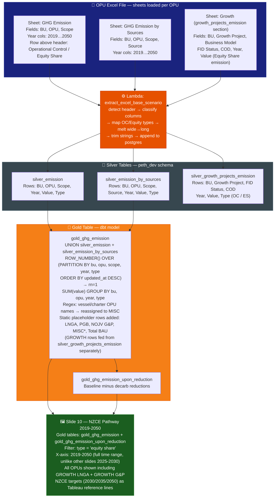

# Slide 10: NZCE Pathway — GHG Emission (Equity Share) 2019-2050

/image10.jpg)

> **Gold table:** `gold_ghg_emission`
> **Source sheets:** `GHG Emission`, `GHG Emission by Sources`, `GHG Emission Reduction (tCO2e)` (growth section)
> **dbt model:** `dbt_project/models/gold_table/gold_ghg_emission.sql`

---

## What This Slide Shows

| Section | Content |
| --- | --- |
| **Full-width chart** | GHG Emission (Equity Share) for G&M Forecast 2019-2050: stacked bar by all OPUs (MLNG, MLNG DUA, MLNG TIGA, TRAIN 9, PFLNG1/2, ZLNG, GPU, GTR, MISC, NOJV LNGA, NOJV G&P, GROWTH LNGA, GROWTH G&P) + Upon Reduction line + Total ES dashed line + NZCE 2030/2035/2050 targets |
| **Key assumption bullets** | Existing assets continue; new-generation LNG near-zero; G&P incorporates hydrogen/CCS co-combustion |

---

## Data Flow Diagram

---

## Gold Table Used

`gold_ghg_emission` — full ES basis; year range 2019-2050 (not filtered to 2025-2030). `gold_ghg_emission_upon_reduction` for the Upon Reduction line. NZCE target lines are Tableau reference line constants.

---

## Calculation Logic

| Step | Logic | Code Reference |
| --- | --- | --- |
| 1 | `UNION ALL` silver_emission + silver_emission_by_sources | `gold_ghg_emission.sql` |
| 2 | `ROW_NUMBER()` dedup by latest `updated_at` | `gold_ghg_emission.sql` |
| 3 | `SUM(value)` per bu, opu, year, type | `gold_ghg_emission.sql` |
| 4 | Regex reassignment of vessel/charter OPU names → MISC | `gold_ghg_emission.sql` |
| 5 | Tableau filters `type = 'equity share'` for this slide | (Tableau filter) |
| 6 | NZCE targets (2030/2035/2050 % reduction) = Tableau reference lines or parameters | (Tableau constants) |

---

## Source Files

| File | Role |
| --- | --- |
| `functions/extract_excel_base_scenario/lambda_handler.py` | Parses GHG Emission + by Sources + Growth sheets |
| `dbt_project/models/gold_table/gold_ghg_emission.sql` | Base emission gold layer |
| `dbt_project/models/gold_table/gold_ghg_emission_upon_reduction.sql` | Upon Reduction line |

---

## Key Invariants

| # | Invariant | Code Reference |
| --- | --- | --- |
| 1 | Full year range 2019-2050 displayed — unique among slides (others only show 2025-2030) | Image x-axis |
| 2 | GROWTH LNGA + GROWTH G&P bars appear — sourced from `silver_growth_projects_emission`, FID=Yes | `gold_ghg_emission.sql` (growth merge) |
| 3 | NZCE target lines (2030/2035/2050) are Tableau reference lines, NOT from the pipeline | Image annotations |
| 4 | Same `gold_ghg_emission` used by slides 01, 02, 03, 05, 10 — single source of truth | Cross-slide dependency |

---

## BRD Reference

- **BR-07.3**: NZCE Pathway — full 2019-2050 emission trajectory.
- **BR-02**: Equity Share basis.

---

## Suggestions

| # | Gap / Suggestion | Evidence | Impact |
| --- | --- | --- | --- |
| 1 | **NZCE targets (%, Mil tCO2e) not in the pipeline** — 2030/2035/2050 targets shown on chart are Tableau reference line constants or parameters. If targets change, Tableau must be manually updated separately from the data pipeline. | Image shows coloured target lines; no SQL source | Manual maintenance risk |
| 2 | **Year range 2019-2050 requires all historical + future rows** — if any OPU's historical data (2019-2024) is missing or incorrect in silver, the chart will show a gap. No validation exists in the pipeline for historical completeness. | Image x-axis starts 2019 | Data integrity risk for historical range |
