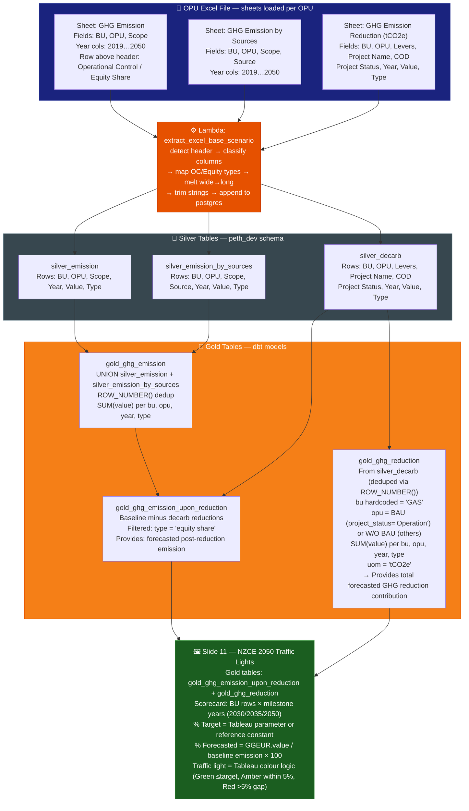

# Slide 11: NZCE 2050 Traffic Lights

/image11.png)

> **Gold tables:** `gold_ghg_emission_upon_reduction` + `gold_ghg_reduction`
> **Source sheets:** `GHG Emission`, `GHG Emission by Sources`, `GHG Emission Reduction (tCO2e)`
> **dbt models:** `gold_ghg_emission_upon_reduction.sql`, `gold_ghg_reduction.sql`

---

## What This Slide Shows

| Section | Content |
| --- | --- |
| **3×4 scorecard grid** | Rows: Gas & Maritime Business, LNG Assets (LNGA), Gas & Power (G&P), Maritime — Columns: 2030, 2035, 2050 |
| **Each cell** | % TARGET GHG Reduction (updated), % FORECASTED GHG REDUCTION (or CONTRIBUTION), traffic-light indicator (Green/Amber/Red) |
| **2050 column** | Also shows: GHG Emission Post Reduction (Mil tCO2e) + Carbon Offset for Hard to Abate |

---

## Data Flow Diagram

---

## Gold Tables Used

| Table | Feeds |
| --- | --- |
| `gold_ghg_emission_upon_reduction` | Forecasted GHG Reduction % per BU at 2030/2035/2050 |
| `gold_ghg_reduction` | Total reduction contribution (BAU vs W/O BAU) per BU/year |

---

## Calculation Logic

### `gold_ghg_reduction`

| Step | Logic | Code Reference |
| --- | --- | --- |
| 1 | Dedup `silver_decarb` via `ROW_NUMBER()` full partition key | `gold_ghg_reduction.sql` L1–17 |
| 2 | `bu` hardcoded = `'GAS'`; `opu` = `'BAU'` (project_status=Operation) or `'W/O BAU'` (others) | `gold_ghg_reduction.sql` L20–23 |
| 3 | `SUM(value)` per opu, year, type | `gold_ghg_reduction.sql` L25 |

### Traffic Light Logic (Tableau-side)

| Element | Source |
| --- | --- |
| % TARGET GHG Reduction | Tableau parameter or reference constant per BU/milestone |
| % FORECASTED = forecasted reduction / 2019 baseline | `gold_ghg_emission_upon_reduction` ÷ baseline `gold_ghg_emission` |
| Traffic light colour | Tableau calculated field: Green ≤ target, Amber within ~5%, Red > 5% gap |

---

## Source Files

| File | Role |
| --- | --- |
| `functions/extract_excel_base_scenario/lambda_handler.py` | Writes silver_emission, silver_emission_by_sources, silver_decarb |
| `dbt_project/models/gold_table/gold_ghg_emission_upon_reduction.sql` | Post-reduction emission at milestone years |
| `dbt_project/models/gold_table/gold_ghg_reduction.sql` | BAU vs W/O BAU reduction totals per BU |

---

## Key Invariants

| # | Invariant | Code Reference |
| --- | --- | --- |
| 1 | `gold_ghg_reduction` collapses all OPUs into `bu='GAS'` — no per-OPU breakdown | `gold_ghg_reduction.sql` L19 |
| 2 | BAU vs W/O BAU split based on `project_status = 'Operation'` | `gold_ghg_reduction.sql` L21–23 |
| 3 | % TARGET values are NOT in the pipeline — Tableau-managed constants | Image labels; no SQL source |
| 4 | Traffic light logic (Green/Amber/Red) is entirely Tableau-side | (no SQL equivalent) |

---

## BRD Reference

- **BR-07.3**: NZCE scorecard — 2030/2035/2050 milestone tracking.
- **BR-02**: Equity Share basis.

---

## Suggestions

| # | Gap / Suggestion | Evidence | Impact |
| --- | --- | --- | --- |
| 1 | **% TARGET values are hardcoded in Tableau** — NZCE targets per BU/milestone are not stored in any silver or gold table. If targets change (e.g. regulatory updates), Tableau must be manually updated. Consider adding a `target_nzce` reference table to the pipeline. | No SQL source for % TARGET | Manual maintenance risk |
| 2 | **Traffic light thresholds not documented** — Green/Amber/Red boundary (5% of target?) is a Tableau calculated field. Not in pipeline or BRD. | Image colour logic; no SQL equivalent | Undocumented business rule |
| 3 | **`gold_ghg_reduction` collapses to `bu='GAS'`** — loses OPU-level detail. Per-BU (LNGA, G&P, Maritime) breakdown in slide requires that Tableau reconstructs BU from another field. Verify how Maritime row is populated. | `gold_ghg_reduction.sql` L19 | BU breakdown logic unclear |
