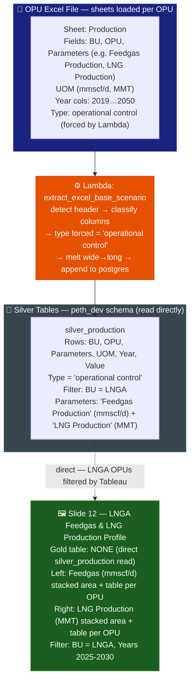

# Slide 12: LNGA Upstream Feedgas & LNG Production Profile

/image12.png)

> **Gold table:** NONE — reads `silver_production` directly
> **Source sheet:** `Production`
> **dbt model:** None (direct silver read for production profile)

---

## What This Slide Shows

| Section | Content |
| --- | --- |
| **Left chart** | Feedgas (mmscf/d): stacked area by LNGA OPU (MLNG, MLNG DUA, MLNG TIGA, TRAIN9, PFLNG1, PFLNG2, ZLNG) — 2025-2030 |
| **Left table** | Feedgas (mmscf/d) per OPU: 2025 (YEP as Aug) + 2026-2030 |
| **Right chart** | LNG Production (MMT): stacked area by LNGA OPU (MLNG, DUA, TIGA, TRAIN9, PFLNG1/2, ZLNG, GLNG, ELNG, LNGC) — 2025-2030 |
| **Right table** | LNG Production (MMT) per OPU: 2025 (YEP as Aug) + 2026-2030 |

---

## Data Flow Diagram

---

## Gold Table Used

**NONE.** This slide reads `silver_production` directly. No gold model aggregates LNGA production profiles — data passes through at OPU × year row level.

---

## Calculation Logic

| Step | Logic | Code Reference |
| --- | --- | --- |
| 1 | Lambda forces `type = 'operational control'` for all production rows | `lambda_handler.py` (production type logic) |
| 2 | Tableau filters: `bu = 'LNGA'` + `parameters IN ('Feedgas Production', 'LNG Production')` | (Tableau filter) |
| 3 | Area chart = `SUM(value)` stacked by OPU per year — done in Tableau | (Tableau aggregation) |
| 4 | Table = per-OPU value per year 2025-2030 — direct silver rows | `silver_production.value` |

---

## Source Files

| File | Role |
| --- | --- |
| `functions/extract_excel_base_scenario/lambda_handler.py` | Parses Production sheet → silver_production |
| `dbt_project/models/sources.yml` | Registers silver_production |

---

## Key Invariants

| # | Invariant | Code Reference |
| --- | --- | --- |
| 1 | No dbt gold model — Tableau reads silver directly; no dedup applied at silver level | (no gold SQL) |
| 2 | Data sourced from BPP LNGA YEP August and P4R 2026-2030 — not from central GHG pipeline | Image references footnote |
| 3 | OPUs shown: MLNG, MLNG DUA, MLNG TIGA, TRAIN9, PFLNG1/2, ZLNG, GLNG, ELNG, LNGC | Image legend |

---

## BRD Reference

- **BR-12**: LNGA production profile — authoritative reference for GHG emission projection.

---

## Suggestions

| # | Gap / Suggestion | Evidence | Impact |
| --- | --- | --- | --- |
| 1 | **No dedup at silver level** — if the same LNGA OPU file is uploaded twice, `silver_production` will contain duplicate rows. Tableau aggregation (SUM) will double-count values. | No `ROW_NUMBER()` guard in pipeline for direct silver reads | Silent data duplication |
| 2 | **Data sourced from BPP LNGA separately** — slide references "YEP as of Aug 2025 from BPP LNGA" as the source, distinct from the standard OPU Excel upload. Confirm whether BPP LNGA data enters the pipeline via the same Lambda or a separate ingestion path. | Image footnote | Provenance gap |
| 3 | **Stacked area and table aggregation is Tableau-side** — `SUM(value) BY opu YEAR` is computed by Tableau, not in a gold model. No pipeline validation of the totals. | No gold SQL equivalent | Unvalidated aggregation |
