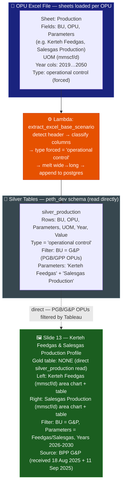

# Slide 13: Kerteh Feedgas & Salesgas Production Profile (PGB)

/image13.png)

> **Gold table:** NONE — reads `silver_production` directly
> **Source sheet:** `Production`
> **dbt model:** None (direct silver read)

---

## What This Slide Shows

| Section | Content |
| --- | --- |
| **Left chart** | Kerteh Feedgas (mmscf/d): area chart — 2026-2030 |
| **Left table** | Kerteh Feedgas per year: 2026-2030 (single row, OPU = PGB or GPP) |
| **Right chart** | Salesgas Production (mmscf/d): area chart — 2026-2030 |
| **Right table** | Salesgas Production per year: 2026-2030 (single row) |

---

## Data Flow Diagram

---

## Gold Table Used

**NONE.** Direct `silver_production` read. Tableau filters for G&P BU, Kerteh Feedgas and Salesgas Production parameters, years 2026-2030.

---

## Calculation Logic

| Step | Logic | Code Reference |
| --- | --- | --- |
| 1 | Lambda forces `type = 'operational control'` | `lambda_handler.py` (production type logic) |
| 2 | Tableau filters: `bu = 'G&P'` (or PGB OPU) + `parameters IN ('Kerteh Feedgas', 'Salesgas Production')` | (Tableau filter) |
| 3 | Area chart + table = direct rows from silver, no aggregation needed for single OPU | `silver_production.value` |
| 4 | Note: analysis excludes NOJVs and Growth projects (per image footnote) | (Tableau filter or source exclusion) |

---

## Source Files

| File | Role |
| --- | --- |
| `functions/extract_excel_base_scenario/lambda_handler.py` | Parses Production sheet → silver_production |
| `dbt_project/models/sources.yml` | Registers silver_production |

---

## Key Invariants

| # | Invariant | Code Reference |
| --- | --- | --- |
| 1 | No gold model — raw silver rows surfaced directly | (no gold SQL) |
| 2 | BPP G&P data sourced on different dates (18 Aug + 11 Sep 2025) — two separate uploads may coexist in silver | Image footnote |
| 3 | NOJVs and Growth projects excluded per footnote — Tableau filter or source data exclusion | Image footnote |

---

## BRD Reference

- **BR-13**: Kerteh production profile — authoritative reference for PGB GHG emission projection.

---

## Suggestions

| # | Gap / Suggestion | Evidence | Impact |
| --- | --- | --- | --- |
| 1 | **Two BPP G&P data submissions (18 Aug + 11 Sep)** — if both are uploaded to `silver_production`, both rows coexist. No dedup is applied at silver level for direct reads. Tableau SUM will double-count. | Image footnote | Duplicate data risk |
| 2 | **NOJV/Growth exclusion filter not documented** — footnote says "excludes profiles from NOJVs and Growth projects" but no WHERE clause in the pipeline enforces this. It is a Tableau filter. | Image footnote; no SQL filter | Undocumented display exclusion |
