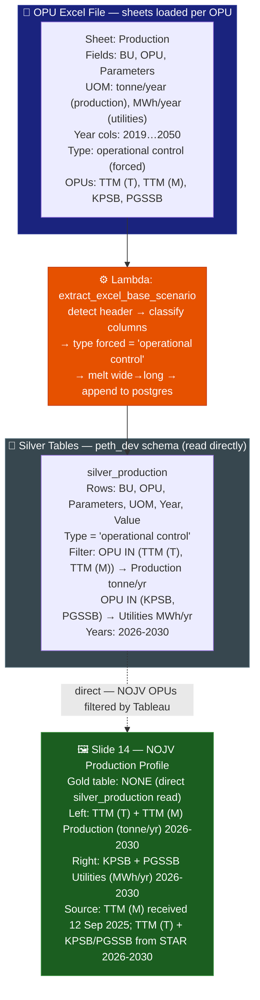

# Slide 14: NOJV Production Profile (TTM + KPSB/PGSSB Utilities)

/image14.png)

> **Gold table:** NONE — reads `silver_production` directly
> **Source sheet:** `Production`
> **dbt model:** None (direct silver read)

---

## What This Slide Shows

| Section | Content |
| --- | --- |
| **Left chart** | Production (tonne/year): area chart by TTM (T) and TTM (M) — 2026-2030 |
| **Left table** | Production per OPU-variant: TTM (T) + TTM (M) — 2026-2030 columns |
| **Right chart** | Utilities (MWh/year): area chart by KPSB and PGSSB — 2026-2030 |
| **Right table** | Utilities per OPU: KPSB + PGSSB — 2026-2030 columns |

---

## Data Flow Diagram

---

## Gold Table Used

**NONE.** Direct `silver_production` read. Tableau filters for NOJV OPUs (TTM T/M, KPSB, PGSSB), years 2026-2030.

---

## Calculation Logic

| Step | Logic | Code Reference |
| --- | --- | --- |
| 1 | Lambda forces `type = 'operational control'` | `lambda_handler.py` (production type logic) |
| 2 | Tableau filters: `OPU IN ('TTM (T)', 'TTM (M)')` for left panel, `OPU IN ('KPSB', 'PGSSB')` for right | (Tableau filter) |
| 3 | UOM filter: tonne/year (production), MWh/year (utilities) | (Tableau filter on `uom`) |
| 4 | Area chart + table = direct silver rows; Tableau sums stacked bars | `silver_production.value` |

---

## Source Files

| File | Role |
| --- | --- |
| `functions/extract_excel_base_scenario/lambda_handler.py` | Parses Production sheet → silver_production |
| `dbt_project/models/sources.yml` | Registers silver_production |

---

## Key Invariants

| # | Invariant | Code Reference |
| --- | --- | --- |
| 1 | No gold model — all aggregation is Tableau-side | (no gold SQL) |
| 2 | TTM has two variants: TTM (T) from STAR 2026-2030 and TTM (M) submitted separately on 12 Sep 2025 | Image footnote |
| 3 | KPSB and PGSSB are Utilities (MWh/yr) — different UOM from production panel (tonne/yr) | Image right panel header |

---

## BRD Reference

- **BR-14**: NOJV production profile — authoritative reference for NOJV G&P GHG emission projection.

---

## Suggestions

| # | Gap / Suggestion | Evidence | Impact |
| --- | --- | --- | --- |
| 1 | **TTM (T) and TTM (M) are separate submissions** — two data sources for the same NOJV entity. If both are in silver simultaneously, Tableau SUM will mix approved and submitted data. Dedup reconciliation not handled in pipeline. | Image footnote | Submission version conflict |
| 2 | **No gold model means no validation layer** — there is no dbt test or assertion that NOJV production values are within expected ranges. A gold model with `WHERE` guards could enforce this. | No gold SQL | Missing data quality gate |
