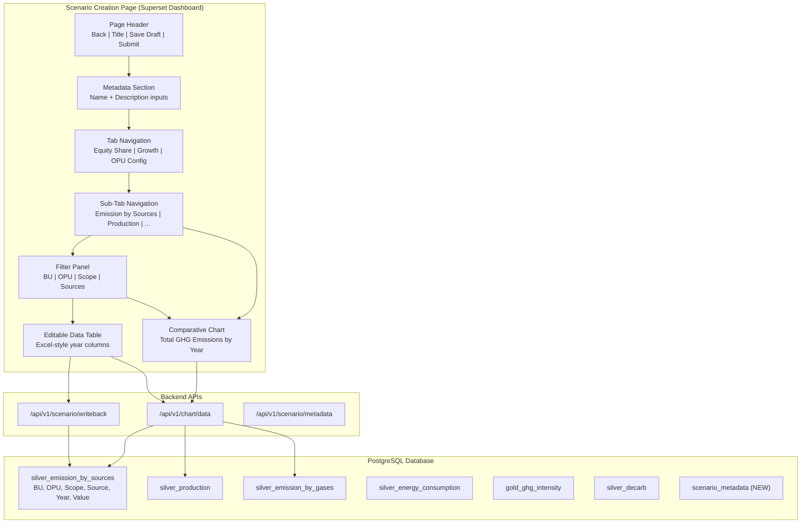

# Technical Specification: Scenario Creation Page

## Executive Summary

Build a **Scenario Creation Page** as a full-page Superset dashboard experience. The page combines scenario metadata entry, configuration tabs, comparative preview charts, and editable data tables with synchronized filtering.

**Scope for Story 1:** OPU Configuration > Emission by Sources tab with full filter and table functionality.

---

## 1. Objectives

| ID | Objective | Priority |
| --- | --- | --- |
| O1 | Create full-page Scenario Creation UI with metadata entry | P0 |
| O2 | Implement 3-level tab navigation (Top > Sub > Data) | P0 |
| O3 | Build synchronized chart + table with cross-filtering | P0 |
| O4 | Enable Save Draft / Submit for Approval workflow | P1 |
| O5 | Support dynamic title updates based on filter context | P1 |

---

## 2. Architecture Overview



---

## 3. Data Sources

### 3.1 Silver Tables for OPU Configuration Tabs

| Tab | Source Table | Key Columns |
| --- | --- | --- |
| Emission by Sources | `silver_emission_by_sources` | bu, opu, scope, source, year, value, type |
| Production | `silver_production` | bu, opu, parameters, uom, year, value |
| Emission by Gases | `silver_emission_by_gases` | bu, opu, scope, gas_type, year, value |
| Energy Consumption | `silver_energy_consumption` | bu, opu, year, value |
| Intensity | `gold_ghg_intensity` | opu, year, value, uom |
| Reduction | `silver_decarb` | bu, opu, levers, year, value |

### 3.2 New Tables Required

#### `scenario_metadata` (NEW)

```sql
CREATE TABLE scenario_metadata (
    id UUID PRIMARY KEY DEFAULT gen_random_uuid(),
    scenario_name TEXT NOT NULL UNIQUE,
    description TEXT,
    status TEXT DEFAULT 'draft',  -- draft, pending_approval, approved, rejected
    created_by TEXT NOT NULL,
    created_at TIMESTAMPTZ DEFAULT now(),
    updated_at TIMESTAMPTZ DEFAULT now(),
    submitted_at TIMESTAMPTZ,
    approved_by TEXT,
    approved_at TIMESTAMPTZ
);
```

### 3.3 Existing Table Schema: `silver_emission_by_sources`

```sql
-- Verified schema
SELECT column_name, data_type
FROM information_schema.columns
WHERE table_name = 'silver_emission_by_sources';

-- Expected columns:
-- bu (TEXT), opu (TEXT), scope (TEXT), source (TEXT),
-- year (INTEGER), value (NUMERIC), type (TEXT),
-- scenario_id (TEXT), user_email (TEXT), updated_at (TIMESTAMPTZ)
```

---

## 4. UI Components

### 4.1 Page Layout Structure

```
┌─────────────────────────────────────────────────────────────────┐
│  ← Back    Scenario Creation              [Save Draft] [Submit] │
├─────────────────────────────────────────────────────────────────┤
│  Name: [________________________]                               │
│  Description: [_________________________________________]       │
├─────────────────────────────────────────────────────────────────┤
│  [Equity Share] [Growth Configuration] [OPU Configuration ▼]   │
├─────────────────────────────────────────────────────────────────┤
│  [Emission by Sources] [Production] [Gases] [Energy] [Intens...]│
├─────────────────────────────────────────────────────────────────┤
│  ┌──────────────────────────────────────────────────────────┐  │
│  │ Comparative Total GHG Emissions – {BU/OPU context}       │  │
│  │ [ECharts Line Chart]                                     │  │
│  └──────────────────────────────────────────────────────────┘  │
├─────────────────────────────────────────────────────────────────┤
│  Filter: [BU ▼] [OPU ▼] [Scope ▼] [Sources ▼]                  │
├─────────────────────────────────────────────────────────────────┤
│  Operational Control – Emission by Sources – {context}         │
│  ┌──────────────────────────────────────────────────────────┐  │
│  │ BU  │ OPU  │ Scope │ Source │ 2024 │ 2025 │ 2026 │ ...  │  │
│  ├─────┼──────┼───────┼────────┼──────┼──────┼──────┼───────│  │
│  │ LNGA│ LNG  │ S1    │ Comb.  │ [45] │ [47] │ [50] │ ...   │  │
│  │ LNGA│ LNG  │ S1    │ Vent.  │ [12] │ [11] │ [10] │ ...   │  │
│  └──────────────────────────────────────────────────────────┘  │
└─────────────────────────────────────────────────────────────────┘
```

### 4.2 Component Hierarchy

```
ScenarioCreationPage (NEW)
├── PageHeader
│   ├── BackButton
│   ├── PageTitle
│   ├── SaveDraftButton
│   └── SubmitButton
├── MetadataSection
│   ├── NameInput
│   └── DescriptionInput
├── TabNavigation (Ant Design Tabs)
│   ├── EquityShareTab
│   ├── GrowthConfigTab
│   └── OPUConfigTab
│       ├── SubTabNavigation (Ant Design Tabs)
│       │   ├── EmissionBySources (Story 1 Scope)
│       │   ├── Production
│       │   ├── EmissionByGases
│       │   ├── EnergyConsumption
│       │   ├── Intensity
│       │   └── Reduction
│       ├── ComparativeChart (ECharts)
│       ├── FilterPanel
│       │   ├── BUSelect
│       │   ├── OPUSelect
│       │   ├── ScopeSelect
│       │   └── SourcesSelect
│       └── EditableDataTable
│           ├── HeaderRow (Year columns)
│           └── DataRow (EditableCell per year)
```

---

## 5. Implementation Plan

### Phase 1: Database Schema (T1-T2)

#### T1 — Create `scenario_metadata` table

**File:** `scripts/init_db_script/create_scenario_metadata.sql`

```sql
CREATE TABLE IF NOT EXISTS scenario_metadata (
    id UUID PRIMARY KEY DEFAULT gen_random_uuid(),
    scenario_name TEXT NOT NULL UNIQUE,
    description TEXT,
    status TEXT DEFAULT 'draft',
    created_by TEXT NOT NULL,
    created_at TIMESTAMPTZ DEFAULT now(),
    updated_at TIMESTAMPTZ DEFAULT now(),
    submitted_at TIMESTAMPTZ,
    approved_by TEXT,
    approved_at TIMESTAMPTZ,
    CHECK (status IN ('draft', 'pending_approval', 'approved', 'rejected'))
);

CREATE INDEX idx_scenario_metadata_status ON scenario_metadata(status);
CREATE INDEX idx_scenario_metadata_created_by ON scenario_metadata(created_by);
```

#### T2 — Add scenario_id column to `silver_emission_by_sources` (if missing)

**File:** `scripts/init_db_script/alter_emission_sources.sql`

```sql
ALTER TABLE silver_emission_by_sources
ADD COLUMN IF NOT EXISTS scenario_id TEXT DEFAULT 'base';

ALTER TABLE silver_emission_by_sources
ADD COLUMN IF NOT EXISTS user_email TEXT DEFAULT '';

CREATE INDEX IF NOT EXISTS idx_emission_sources_scenario
ON silver_emission_by_sources(scenario_id, user_email);
```

---

### Phase 2: Backend APIs (T3-T5)

#### T3 — Scenario Metadata API

**File:** `superset/superset/views/scenario_metadata.py`

```python
class ScenarioMetadataView(BaseSupersetView):
    route_base = "/api/v1/scenario/metadata"

    @has_access_api
    @expose("/", methods=("GET",))
    def list(self):
        """List all scenarios for current user"""
        pass

    @has_access_api
    @expose("/", methods=("POST",))
    def create(self):
        """Create new scenario"""
        pass

    @has_access_api
    @expose("/<scenario_id>", methods=("PUT",))
    def update(self, scenario_id):
        """Update scenario metadata"""
        pass

    @has_access_api
    @expose("/<scenario_id>/submit", methods=("POST",))
    def submit(self, scenario_id):
        """Submit scenario for approval"""
        pass
```

#### T4 — Extend Writeback API for Emission by Sources

**File:** `superset/superset/views/scenario_writeback.py` (extend existing)

```python
@has_access_api
@expose("/emission-sources", methods=("POST",))
def writeback_emission_sources(self):
    """Write back edits to silver_emission_by_sources"""
    payload = request.get_json()
    # Required: bu, opu, scope, source, year, value, scenario_id
    # UPSERT to silver_emission_by_sources
    pass
```

#### T5 — Register Blueprint

**File:** `superset_config.py`

```python
FLASK_APP_MUTATOR = lambda app: app.register_blueprint(
    scenario_metadata_bp, url_prefix='/api/v1/scenario/metadata'
)
```

---

### Phase 3: Frontend Components (T6-T10)

#### T6 — Create ScenarioCreationPage Component

**File:** `superset/superset-frontend/src/scenario/ScenarioCreationPage.tsx`

```typescript
interface ScenarioCreationPageProps {
  scenarioId?: string;  // For editing existing scenario
}

export function ScenarioCreationPage({ scenarioId }: ScenarioCreationPageProps) {
  const [metadata, setMetadata] = useState<ScenarioMetadata>({
    name: '',
    description: '',
    status: 'draft',
  });
  const [activeTopTab, setActiveTopTab] = useState('opu');
  const [activeSubTab, setActiveSubTab] = useState('emission-sources');
  const [filters, setFilters] = useState<FilterState>({
    bu: null,
    opu: null,
    scope: null,
    source: null,
  });

  // ... render logic
}
```

#### T7 — Create ComparativeChart Component

**File:** `superset/superset-frontend/src/scenario/ComparativeChart.tsx`

```typescript
interface ComparativeChartProps {
  title: string;  // Dynamic: "Comparative Total GHG Emissions – {BU}"
  filters: FilterState;
  dataSource: string;  // Dataset ID
}

export function ComparativeChart({ title, filters, dataSource }: ComparativeChartProps) {
  // Query data via chart/data API
  // Render ECharts line chart
  // Group by scenario, x-axis = year
}
```

#### T8 — Create FilterPanel Component

**File:** `superset/superset-frontend/src/scenario/FilterPanel.tsx`

```typescript
interface FilterPanelProps {
  onFilterChange: (filters: FilterState) => void;
  datasetId: number;  // For fetching filter options
}

export function FilterPanel({ onFilterChange, datasetId }: FilterPanelProps) {
  // Fetch distinct values for BU, OPU, Scope, Sources
  // Render Ant Design Select components
  // Emit filter changes to parent
}
```

#### T9 — Create EditableDataTable Component

**File:** `superset/superset-frontend/src/scenario/EditableDataTable.tsx`

```typescript
interface EditableDataTableProps {
  title: string;  // Dynamic: "Operational Control – Emission by Sources – {BU}"
  filters: FilterState;
  datasetId: number;
  onCellEdit: (row: DataRow, year: number, value: number) => void;
}

export function EditableDataTable({ title, filters, datasetId, onCellEdit }: EditableDataTableProps) {
  // Query data with filters
  // Transform to Excel-style pivot (rows = BU/OPU/Scope/Source, columns = years)
  // Render table with EditableCell components
}
```

#### T10 — Add Route to Superset

**File:** `superset/superset-frontend/src/routes/routes.tsx`

```typescript
{
  path: '/scenario/create',
  component: ScenarioCreationPage,
}
```

---

### Phase 4: Integration & Testing (T11-T13)

#### T11 — Integration Tests for APIs

**File:** `superset/tests/integration_tests/views/test_scenario_metadata.py`

```python
def test_create_scenario(client):
    response = client.post('/api/v1/scenario/metadata/', json={
        'name': 'Test Scenario',
        'description': 'Test description'
    })
    assert response.status_code == 200

def test_submit_scenario(client):
    # Create, then submit
    pass
```

#### T12 — E2E Tests with Playwright

**File:** `superset/superset-frontend/playwright/tests/scenario-creation.spec.ts`

```typescript
test('Create scenario and edit emission data', async ({ page }) => {
  await page.goto('/scenario/create');
  await page.fill('[name="scenario-name"]', 'Test Scenario 2026');
  await page.fill('[name="scenario-description"]', 'Annual forecast');

  // Navigate to OPU > Emission by Sources
  await page.click('[data-test="tab-opu-configuration"]');
  await page.click('[data-test="subtab-emission-sources"]');

  // Apply filter
  await page.selectOption('[data-test="filter-bu"]', 'LNGA');

  // Verify chart title updated
  await expect(page.locator('[data-test="chart-title"]')).toContainText('LNGA');

  // Edit cell
  await page.click('[data-test="cell-0-2024"]');
  await page.fill('[data-test="cell-input"]', '50');
  await page.press('[data-test="cell-input"]', 'Enter');

  // Verify chart updated
});
```

#### T13 — Visual Regression Tests

**File:** `tests/e2e/screenshots/scenario-creation.spec.ts`

---

## 6. Acceptance Criteria

| ACID | Description | Verification |
| --- | --- | --- |
| AC1 | Page loads with metadata inputs visible | Screenshot |
| AC2 | Tab navigation switches between 3 top-level tabs | E2E test |
| AC3 | Sub-tab navigation shows 6 OPU config options | E2E test |
| AC4 | Chart renders with dynamic title based on filters | E2E test |
| AC5 | Table renders with Excel-style year columns | Visual test |
| AC6 | Filter changes update both chart and table | E2E test |
| AC7 | Cell edits persist to database | Integration test |
| AC8 | Save Draft button updates scenario status | Integration test |
| AC9 | Submit button changes status to pending_approval | Integration test |

---

## 7. Dependencies

| Dependency | Required | Status |
| --- | --- | --- |
| `silver_emission_by_sources` table | YES | EXISTS |
| `silver_production` table | YES | EXISTS |
| `scenario_metadata` table | YES | NEW (T1) |
| Scenario writeback API | YES | EXISTS (extend T4) |
| EditableCell component | YES | EXISTS in plugin-chart-scenario |
| Superset authentication | YES | EXISTS |

---

## 8. Risk Register

| Risk | Likelihood | Impact | Mitigation |
| --- | --- | --- | --- |
| Large dataset performance | Medium | High | Implement pagination, query caching |
| CSRF blocking API writes | High | Medium | Use database bypass pattern from Slide 1 |
| Filter synchronization complexity | Medium | Medium | Use React context for filter state |

---

## 9. File Manifest

### New Files

| File | Purpose |
| --- | --- |
| `scripts/init_db_script/create_scenario_metadata.sql` | DDL for metadata table |
| `superset/superset/views/scenario_metadata.py` | Metadata CRUD API |
| `superset/superset-frontend/src/scenario/ScenarioCreationPage.tsx` | Main page component |
| `superset/superset-frontend/src/scenario/ComparativeChart.tsx` | Chart component |
| `superset/superset-frontend/src/scenario/FilterPanel.tsx` | Filter UI |
| `superset/superset-frontend/src/scenario/EditableDataTable.tsx` | Table component |
| `superset/superset-frontend/src/scenario/types.ts` | TypeScript interfaces |
| `superset/superset-frontend/src/scenario/useScenarioFilters.ts` | Filter state hook |
| `tests/e2e/scenario-creation.spec.ts` | E2E tests |

### Modified Files

| File | Changes |
| --- | --- |
| `superset/superset/views/scenario_writeback.py` | Add emission-sources endpoint |
| `superset_config.py` | Register metadata blueprint |
| `superset/superset-frontend/src/routes/routes.tsx` | Add /scenario/create route |

---

## 10. References

| Ref | Location |
| --- | --- |
| Requirements | `vault/expect/desc.md` |
| UI Reference | `vault/expect/expected_scenario.png` |
| Existing Plugin | `superset/superset-frontend/plugins/plugin-chart-scenario/` |
| Writeback API | `superset/superset/views/scenario_writeback.py` |
| Silver Tables | `peth_dev` schema in PostgreSQL |